# LLM token embeddings


<!-- WARNING: THIS FILE WAS AUTOGENERATED! DO NOT EDIT! -->

``` python
#from transformers import pipeline
```

``` python
# Doesn't produce any content (probably using incorrectly)
#pipe = pipeline("text-generation", model="nroggendorff/smallama-it")
#pipe = pipeline("text-generation", model="KingNish/Qwen2.5-0.5b-Test-ft")
```

``` python
def clean_memory():
    with torch.no_grad():
        torch.cuda.empty_cache()
    gc.collect()
```

For our experiments let’s grab a small language model. In this case, I
will use Qwen2.5-0.5B. It fits in just about 1GB of VRAM, so it’s great
for experimentation!

``` python
model_name = "Qwen/Qwen2.5-0.5B-Instruct"

model = AutoModelForCausalLM.from_pretrained(
    model_name,
    torch_dtype="auto",
    device_map="auto"
)
tokenizer = AutoTokenizer.from_pretrained(model_name)
```

    2025-02-25 01:22:48.553363: E external/local_xla/xla/stream_executor/cuda/cuda_fft.cc:477] Unable to register cuFFT factory: Attempting to register factory for plugin cuFFT when one has already been registered
    WARNING: All log messages before absl::InitializeLog() is called are written to STDERR
    E0000 00:00:1740475368.575449   32363 cuda_dnn.cc:8310] Unable to register cuDNN factory: Attempting to register factory for plugin cuDNN when one has already been registered
    E0000 00:00:1740475368.582244   32363 cuda_blas.cc:1418] Unable to register cuBLAS factory: Attempting to register factory for plugin cuBLAS when one has already been registered

## Generate text

Even though this model is small, it can still generate coherent text:

``` python
def demo(max_new_tokens=2048,prompt=None):
    if not prompt:
        prompt = "Write an introduction for a blog post about large language model token embeddings. Tags: PCA, layer sizes, nearest neighbours, KDTree, singular values."
    messages = [
        {"role": "system", "content": "You are an autocorrelating model. You use previous outputs for reasoning. Pay attention to tags."},
        {"role": "user", "content": prompt}
    ]
    text = tokenizer.apply_chat_template(
        messages,
        tokenize=False,
        add_generation_prompt=True
    )
    model_inputs = tokenizer([text], return_tensors="pt").to(model.device)
    
    generated_ids = model.generate(
        **model_inputs,
        max_new_tokens=max_new_tokens
    )
    generated_ids = [
        output_ids[len(input_ids):] for input_ids, output_ids in zip(model_inputs.input_ids, generated_ids)
    ]
    
    response = tokenizer.batch_decode(generated_ids, skip_special_tokens=True)[0]
    
    display_markdown(response, raw=True)
```

``` python
demo()
```

Welcome to our blog where we explore the fascinating world of large
language models and their intricate relationship with neural networks,
specifically focusing on token embeddings. As you delve deeper into this
topic, you’ll uncover how these mathematical constructs play a crucial
role in understanding complex natural language processing tasks.

In today’s era of artificial intelligence, large language models have
emerged as indispensable tools capable of generating human-like text.
However, they often struggle with handling high-dimensional data due to
their computational demands. One solution that has proven effective is
token embedding, which converts words into numerical representations
using vectors. This technique significantly enhances the performance of
language models by reducing the dimensionality of input data.

One method used to achieve this is through the application of Principal
Component Analysis (PCA) to reduce the complexity of the data while
preserving most of its variance. By analyzing the first few principal
components, we can effectively represent the underlying structure of the
data. This approach is particularly useful when dealing with large
datasets or when the number of features exceeds the capacity of
traditional methods like k-nearest neighbors or KD-trees.

Another powerful technique is utilizing the concept of layer sizes in
deep learning. Understanding the architecture of a network helps us
comprehend how information flows between layers and what kind of
patterns emerge at each stage. By examining the learned weights and
activations from different layers, we gain insights into the function of
each component in the neural network.

Lastly, we delve into the realm of Singular Value Decomposition (SVD),
which is employed to extract the essential features of the dataset. SVD
decomposes the input matrix into three parts: the left singular vectors,
the right singular vectors, and the diagonal matrix containing the
singular values. These components allow us to visualize the importance
of various features in the context of the entire dataset.

Understanding these techniques and their interplay within the framework
of large language models will provide you with valuable insights into
the complexities involved in training and deploying such models. Whether
you’re a seasoned AI researcher or just starting out, exploring these
concepts can lead to significant advancements in your work. Stay tuned
for more updates and stay curious!

``` python
demo()
```

Welcome to our blog post exploring the fascinating world of large
language models and their groundbreaking advancements in text
generation! In this article, we delve into the complex world of token
embeddings, which play a crucial role in understanding how these models
process and generate human-like language. We’ll dive deep into the
intricacies of PCA (Principal Component Analysis), layer sizes, nearest
neighbors, KDTree (K-D Tree) implementation, and singular values,
providing a comprehensive overview of the topic.

From understanding the importance of token embeddings in natural
language processing to mastering advanced techniques like nearest
neighbors and KDTree implementations, you’ll discover not only the
technical aspects but also the practical applications that these methods
have revolutionized. Whether you’re a seasoned data scientist or just
starting out in the field, this blog post promises to be an enlightening
journey through the depths of machine learning and natural language
processing. So grab your notebook and get ready to explore the next
frontier in AI technology!

``` python
demo()
```

In today’s digital age, the role of large language models (LLMs) in
various fields has become increasingly prominent. These models,
particularly those trained on large datasets, have generated significant
advancements across several domains such as natural language processing
(NLP), speech recognition, and more recently, text generation. However,
one aspect that has not been fully explored is the representation of
input data within these LLMs—a critical yet often overlooked step in
their training process.

Large language models rely heavily on understanding the context of
inputs they encounter during their training phase. To achieve this, they
employ embedding layers to convert textual data into numerical vectors.
This conversion involves capturing both the meaning of the words
themselves as well as contextual information that might be present. The
goal is to map the raw text data into a higher-dimensional space where
it can be effectively analyzed by the model. This process is known as
tokenization or vectorization.

PCA (Principal Component Analysis) plays a pivotal role in this process
because it helps identify the most important features in the dataset. By
analyzing the variance captured by each principal component, we can
understand which aspects of the input data are most relevant for the
model’s performance. Layer sizes, specifically the number of hidden
units in the neural networks, significantly influence the complexity and
dimensionality of the embedding space. The choice between dense and
sparse layers depends on the nature of the task at hand; dense layers
are used when there is ample context available, whereas sparse layers
are preferred when the context is sparse.

Nearest Neighbors (NN) techniques are essential for learning embeddings
based on proximity to other tokens. KDTree (K-d Tree) algorithms
efficiently store and query point sets, making them ideal for spatially
distributed data like text documents. The selection of optimal
parameters for these algorithms, including tree depth and leaf size, is
crucial for achieving effective token embeddings.

Singular Value Decomposition (SVD) is another powerful tool for
understanding the structure of the input data. It decomposes the matrix
formed by the embedding vectors into three matrices—U, Σ, and V^T—and
provides insights into how much of the total variance is explained by
each feature. This decomposition allows us to understand the relative
importance of different dimensions in the embedding space.

Understanding these components—PCA, layer sizes, nearest neighbors,
KDTree, and SVD—can greatly enhance our comprehension of how LLMs handle
and represent input data. This knowledge will be invaluable in
optimizing the training process, improving model performance, and
leveraging the full potential of these powerful tools.

## LLM Parameters

An LLM is made from an embedding layer, followed by transformer layers.
Let’s look at their sizes:

``` python
sizes = list(map(lambda x: (np.prod(x.shape), x.shape), model.model.parameters()))
sizes[:10]
```

    [(136134656, torch.Size([151936, 896])),
     (802816, torch.Size([896, 896])),
     (896, torch.Size([896])),
     (114688, torch.Size([128, 896])),
     (128, torch.Size([128])),
     (114688, torch.Size([128, 896])),
     (128, torch.Size([128])),
     (802816, torch.Size([896, 896])),
     (4358144, torch.Size([4864, 896])),
     (4358144, torch.Size([4864, 896]))]

Size of the embedding layer seems to dominate model size for this
particular model:

``` python
df = pd.DataFrame(sizes, columns=['size', 'shape'])
df.iloc[:40].plot(y = 'size', kind='bar')
```

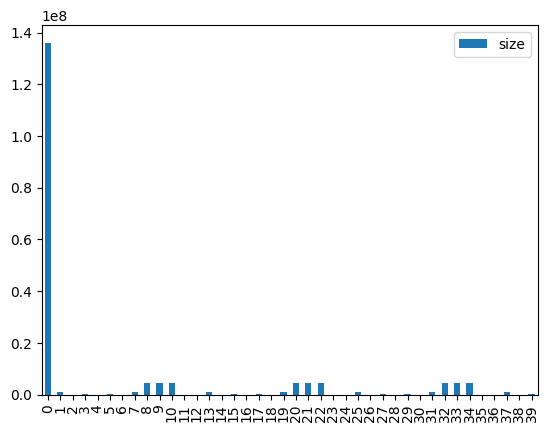

In fact, let’s compare size of embeddings with the rest of the model
parameters:

``` python
df.loc[0,'size']/df.loc[:, 'size'].sum()
```

    0.275557948415276

So, 28% of the model is in the embeddings.

## PCA

Now let’s look at embeddings in more detail

``` python
emb = model.get_input_embeddings()
emb_w = emb.weight
emb_w.shape
```

    torch.Size([151936, 896])

We have about 150k tokens, and we use 896 dimensions to encode them.
Let’s see if there is any visible structure among them.

``` python
w = emb_w.cpu().detach()
w = w.type(torch.Tensor)
```

Numbers, characters, symbols seem to be nicely grouped together:

``` python
w_pca = w.pca(3)
```

``` python
w_pca.shape
```

    torch.Size([151936, 3])

``` python
fac0,fac1,fac2 = w_pca.t()[:3]
p = 0
idxs = list(range(p,p + 100))
X = fac0[idxs]
Y = fac2[idxs]
plt.figure(figsize=(12,12))
plt.scatter(X, Y)
token_labels = [tokenizer.decode([i]) for i in idxs]
for i, x, y in zip(token_labels, X, Y):
    plt.text(x,y,i, color=np.random.rand(3)*0.7, fontsize=14)
#plt.show()
#plt.savefig('token_encodings.png')
```

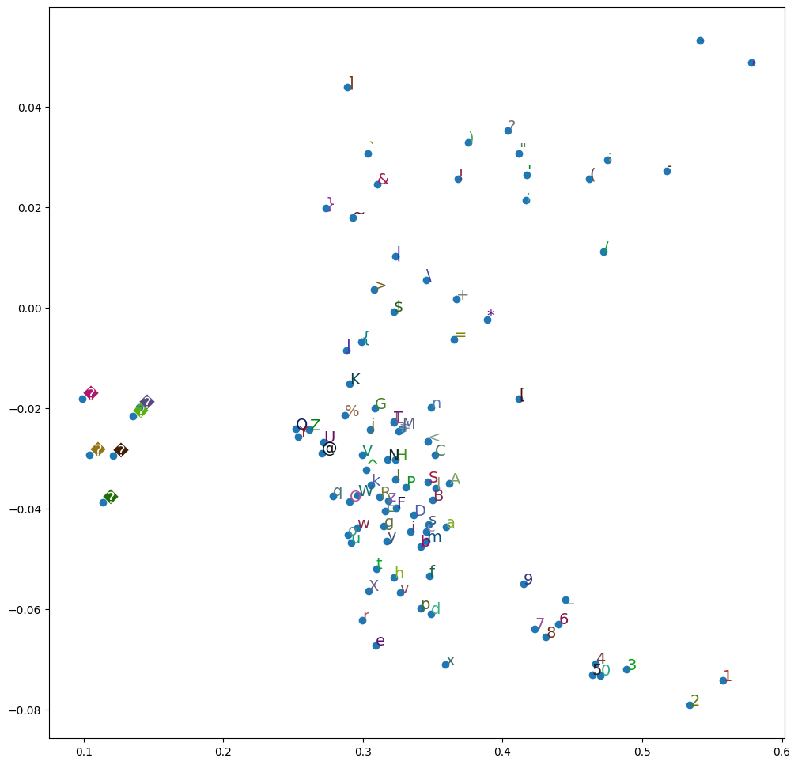

## Understanding token embeddings

Now let’s check if there are any tokens that have very similar
encodings.

``` python
token_labels = L([tokenizer.decode([i]) for i in range(w.shape[0])])
token_labels
```

    (#151936) ['!','"','#','$','%','&',"'",'(',')','*','+',',','-','.','/','0','1','2','3','4'...]

``` python
w.T.shape
```

    torch.Size([896, 151936])

``` python
df = pd.DataFrame(w.T, columns=token_labels)
```

Here is a correlation matrix of first 500 tokens. Notice that there is a
suspicious cluster of tokens with large correlation.

``` python
plt.matshow(df.iloc[:,:500].corr())
```

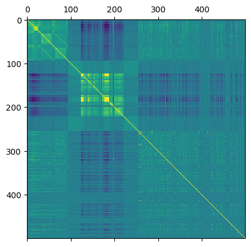

``` python
df.iloc[:,124:130].corr()
```

<div>
<style scoped>
    .dataframe tbody tr th:only-of-type {
        vertical-align: middle;
    }
&#10;    .dataframe tbody tr th {
        vertical-align: top;
    }
&#10;    .dataframe thead th {
        text-align: right;
    }
</style>

<table class="dataframe" data-quarto-postprocess="true" data-border="1">
<thead>
<tr style="text-align: right;">
<th data-quarto-table-cell-role="th"></th>
<th data-quarto-table-cell-role="th">�</th>
<th data-quarto-table-cell-role="th">�</th>
<th data-quarto-table-cell-role="th">�</th>
<th data-quarto-table-cell-role="th">�</th>
<th data-quarto-table-cell-role="th">�</th>
<th data-quarto-table-cell-role="th">�</th>
</tr>
</thead>
<tbody>
<tr>
<td data-quarto-table-cell-role="th">�</td>
<td>1.000000</td>
<td>1.000000</td>
<td>0.036561</td>
<td>0.949049</td>
<td>0.999370</td>
<td>0.613330</td>
</tr>
<tr>
<td data-quarto-table-cell-role="th">�</td>
<td>1.000000</td>
<td>1.000000</td>
<td>0.036553</td>
<td>0.949040</td>
<td>0.999370</td>
<td>0.613357</td>
</tr>
<tr>
<td data-quarto-table-cell-role="th">�</td>
<td>0.036561</td>
<td>0.036553</td>
<td>1.000000</td>
<td>0.039240</td>
<td>0.036404</td>
<td>0.066037</td>
</tr>
<tr>
<td data-quarto-table-cell-role="th">�</td>
<td>0.949049</td>
<td>0.949040</td>
<td>0.039240</td>
<td>1.000000</td>
<td>0.948284</td>
<td>0.574783</td>
</tr>
<tr>
<td data-quarto-table-cell-role="th">�</td>
<td>0.999370</td>
<td>0.999370</td>
<td>0.036404</td>
<td>0.948284</td>
<td>1.000000</td>
<td>0.615100</td>
</tr>
<tr>
<td data-quarto-table-cell-role="th">�</td>
<td>0.613330</td>
<td>0.613357</td>
<td>0.066037</td>
<td>0.574783</td>
<td>0.615100</td>
<td>1.000000</td>
</tr>
</tbody>
</table>

</div>

``` python
plt.matshow(df.iloc[:,124:225].corr())
```

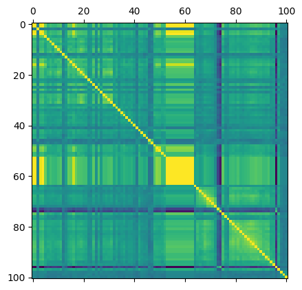

``` python
plt.matshow(df.iloc[:,177:190].corr())
```

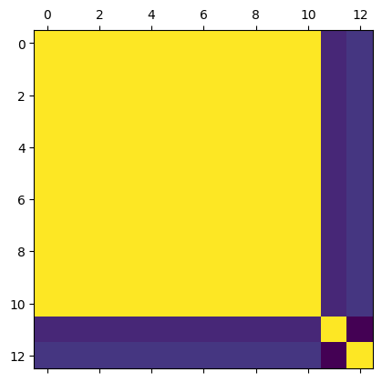

``` python
df.iloc[:,177:190].corr()
```

<div>
<style scoped>
    .dataframe tbody tr th:only-of-type {
        vertical-align: middle;
    }
&#10;    .dataframe tbody tr th {
        vertical-align: top;
    }
&#10;    .dataframe thead th {
        text-align: right;
    }
</style>

<table class="dataframe" data-quarto-postprocess="true" data-border="1">
<thead>
<tr style="text-align: right;">
<th data-quarto-table-cell-role="th"></th>
<th data-quarto-table-cell-role="th">�</th>
<th data-quarto-table-cell-role="th">�</th>
<th data-quarto-table-cell-role="th">�</th>
<th data-quarto-table-cell-role="th">�</th>
<th data-quarto-table-cell-role="th">�</th>
<th data-quarto-table-cell-role="th">�</th>
<th data-quarto-table-cell-role="th">�</th>
<th data-quarto-table-cell-role="th">�</th>
<th data-quarto-table-cell-role="th">�</th>
<th data-quarto-table-cell-role="th">�</th>
<th data-quarto-table-cell-role="th">�</th>
<th data-quarto-table-cell-role="th"></th>
<th data-quarto-table-cell-role="th"></th>
</tr>
</thead>
<tbody>
<tr>
<td data-quarto-table-cell-role="th">�</td>
<td>1.000000</td>
<td>1.000000</td>
<td>1.000000</td>
<td>1.000000</td>
<td>1.000000</td>
<td>1.000000</td>
<td>1.000000</td>
<td>1.000000</td>
<td>1.000000</td>
<td>1.000000</td>
<td>1.000000</td>
<td>0.286441</td>
<td>0.324009</td>
</tr>
<tr>
<td data-quarto-table-cell-role="th">�</td>
<td>1.000000</td>
<td>1.000000</td>
<td>0.999999</td>
<td>1.000000</td>
<td>1.000000</td>
<td>1.000000</td>
<td>1.000000</td>
<td>1.000000</td>
<td>1.000000</td>
<td>1.000000</td>
<td>1.000000</td>
<td>0.286423</td>
<td>0.324003</td>
</tr>
<tr>
<td data-quarto-table-cell-role="th">�</td>
<td>1.000000</td>
<td>0.999999</td>
<td>1.000000</td>
<td>1.000000</td>
<td>1.000000</td>
<td>1.000000</td>
<td>1.000000</td>
<td>1.000000</td>
<td>1.000000</td>
<td>1.000000</td>
<td>1.000000</td>
<td>0.286415</td>
<td>0.323999</td>
</tr>
<tr>
<td data-quarto-table-cell-role="th">�</td>
<td>1.000000</td>
<td>1.000000</td>
<td>1.000000</td>
<td>1.000000</td>
<td>1.000000</td>
<td>1.000000</td>
<td>1.000000</td>
<td>1.000000</td>
<td>1.000000</td>
<td>1.000000</td>
<td>1.000000</td>
<td>0.286428</td>
<td>0.324013</td>
</tr>
<tr>
<td data-quarto-table-cell-role="th">�</td>
<td>1.000000</td>
<td>1.000000</td>
<td>1.000000</td>
<td>1.000000</td>
<td>1.000000</td>
<td>1.000000</td>
<td>1.000000</td>
<td>1.000000</td>
<td>1.000000</td>
<td>1.000000</td>
<td>1.000000</td>
<td>0.286434</td>
<td>0.324009</td>
</tr>
<tr>
<td data-quarto-table-cell-role="th">�</td>
<td>1.000000</td>
<td>1.000000</td>
<td>1.000000</td>
<td>1.000000</td>
<td>1.000000</td>
<td>1.000000</td>
<td>1.000000</td>
<td>1.000000</td>
<td>1.000000</td>
<td>1.000000</td>
<td>1.000000</td>
<td>0.286445</td>
<td>0.324002</td>
</tr>
<tr>
<td data-quarto-table-cell-role="th">�</td>
<td>1.000000</td>
<td>1.000000</td>
<td>1.000000</td>
<td>1.000000</td>
<td>1.000000</td>
<td>1.000000</td>
<td>1.000000</td>
<td>1.000000</td>
<td>1.000000</td>
<td>1.000000</td>
<td>1.000000</td>
<td>0.286447</td>
<td>0.324016</td>
</tr>
<tr>
<td data-quarto-table-cell-role="th">�</td>
<td>1.000000</td>
<td>1.000000</td>
<td>1.000000</td>
<td>1.000000</td>
<td>1.000000</td>
<td>1.000000</td>
<td>1.000000</td>
<td>1.000000</td>
<td>1.000000</td>
<td>1.000000</td>
<td>1.000000</td>
<td>0.286421</td>
<td>0.323967</td>
</tr>
<tr>
<td data-quarto-table-cell-role="th">�</td>
<td>1.000000</td>
<td>1.000000</td>
<td>1.000000</td>
<td>1.000000</td>
<td>1.000000</td>
<td>1.000000</td>
<td>1.000000</td>
<td>1.000000</td>
<td>1.000000</td>
<td>1.000000</td>
<td>1.000000</td>
<td>0.286428</td>
<td>0.323993</td>
</tr>
<tr>
<td data-quarto-table-cell-role="th">�</td>
<td>1.000000</td>
<td>1.000000</td>
<td>1.000000</td>
<td>1.000000</td>
<td>1.000000</td>
<td>1.000000</td>
<td>1.000000</td>
<td>1.000000</td>
<td>1.000000</td>
<td>1.000000</td>
<td>1.000000</td>
<td>0.286425</td>
<td>0.324003</td>
</tr>
<tr>
<td data-quarto-table-cell-role="th">�</td>
<td>1.000000</td>
<td>1.000000</td>
<td>1.000000</td>
<td>1.000000</td>
<td>1.000000</td>
<td>1.000000</td>
<td>1.000000</td>
<td>1.000000</td>
<td>1.000000</td>
<td>1.000000</td>
<td>1.000000</td>
<td>0.286441</td>
<td>0.324025</td>
</tr>
<tr>
<td data-quarto-table-cell-role="th"></td>
<td>0.286441</td>
<td>0.286423</td>
<td>0.286415</td>
<td>0.286428</td>
<td>0.286434</td>
<td>0.286445</td>
<td>0.286447</td>
<td>0.286421</td>
<td>0.286428</td>
<td>0.286425</td>
<td>0.286441</td>
<td>1.000000</td>
<td>0.196765</td>
</tr>
<tr>
<td data-quarto-table-cell-role="th"></td>
<td>0.324009</td>
<td>0.324003</td>
<td>0.323999</td>
<td>0.324013</td>
<td>0.324009</td>
<td>0.324002</td>
<td>0.324016</td>
<td>0.323967</td>
<td>0.323993</td>
<td>0.324003</td>
<td>0.324025</td>
<td>0.196765</td>
<td>1.000000</td>
</tr>
</tbody>
</table>

</div>

These have almost perfect correlation. But these seem to correspond to
some special byte sequences. Perhaps this has something to do with
unicode?

We can also put token embeddings into a dataframe, and join it together
with token labels sequence for convenience:

``` python
df = pd.DataFrame(w)

df['token'] = token_labels
df = df.reindex(columns=pd.Index([df.columns[-1]] + list(df.columns[:-1])))

df
```

<div>
<style scoped>
    .dataframe tbody tr th:only-of-type {
        vertical-align: middle;
    }
&#10;    .dataframe tbody tr th {
        vertical-align: top;
    }
&#10;    .dataframe thead th {
        text-align: right;
    }
</style>

<table class="dataframe" data-quarto-postprocess="true" data-border="1">
<thead>
<tr style="text-align: right;">
<th data-quarto-table-cell-role="th"></th>
<th data-quarto-table-cell-role="th">token</th>
<th data-quarto-table-cell-role="th">0</th>
<th data-quarto-table-cell-role="th">1</th>
<th data-quarto-table-cell-role="th">2</th>
<th data-quarto-table-cell-role="th">3</th>
<th data-quarto-table-cell-role="th">4</th>
<th data-quarto-table-cell-role="th">5</th>
<th data-quarto-table-cell-role="th">6</th>
<th data-quarto-table-cell-role="th">7</th>
<th data-quarto-table-cell-role="th">8</th>
<th data-quarto-table-cell-role="th">...</th>
<th data-quarto-table-cell-role="th">886</th>
<th data-quarto-table-cell-role="th">887</th>
<th data-quarto-table-cell-role="th">888</th>
<th data-quarto-table-cell-role="th">889</th>
<th data-quarto-table-cell-role="th">890</th>
<th data-quarto-table-cell-role="th">891</th>
<th data-quarto-table-cell-role="th">892</th>
<th data-quarto-table-cell-role="th">893</th>
<th data-quarto-table-cell-role="th">894</th>
<th data-quarto-table-cell-role="th">895</th>
</tr>
</thead>
<tbody>
<tr>
<td data-quarto-table-cell-role="th">0</td>
<td>!</td>
<td>-0.010376</td>
<td>0.040771</td>
<td>0.009705</td>
<td>0.000070</td>
<td>-0.027100</td>
<td>-0.002975</td>
<td>-0.001160</td>
<td>-0.019531</td>
<td>0.028442</td>
<td>...</td>
<td>-0.008179</td>
<td>0.016724</td>
<td>0.022339</td>
<td>-0.027222</td>
<td>-0.029541</td>
<td>-0.015381</td>
<td>-0.007477</td>
<td>0.009827</td>
<td>0.013611</td>
<td>-0.006683</td>
</tr>
<tr>
<td data-quarto-table-cell-role="th">1</td>
<td>"</td>
<td>-0.014587</td>
<td>-0.001366</td>
<td>-0.017700</td>
<td>-0.002670</td>
<td>0.003708</td>
<td>-0.001495</td>
<td>0.005402</td>
<td>-0.010620</td>
<td>0.017700</td>
<td>...</td>
<td>-0.013672</td>
<td>-0.038330</td>
<td>0.003433</td>
<td>-0.007355</td>
<td>-0.007172</td>
<td>0.001152</td>
<td>-0.005798</td>
<td>-0.002441</td>
<td>0.002441</td>
<td>-0.008118</td>
</tr>
<tr>
<td data-quarto-table-cell-role="th">2</td>
<td>#</td>
<td>-0.036621</td>
<td>-0.010193</td>
<td>0.007812</td>
<td>-0.010925</td>
<td>0.008057</td>
<td>0.016724</td>
<td>0.023438</td>
<td>-0.030273</td>
<td>-0.009399</td>
<td>...</td>
<td>-0.024048</td>
<td>-0.002716</td>
<td>0.006134</td>
<td>-0.007538</td>
<td>-0.008545</td>
<td>0.008789</td>
<td>0.011292</td>
<td>-0.007355</td>
<td>-0.017700</td>
<td>-0.000675</td>
</tr>
<tr>
<td data-quarto-table-cell-role="th">3</td>
<td>$</td>
<td>-0.009338</td>
<td>-0.012085</td>
<td>-0.015381</td>
<td>0.010864</td>
<td>0.003967</td>
<td>-0.005981</td>
<td>0.005707</td>
<td>-0.006866</td>
<td>0.014343</td>
<td>...</td>
<td>-0.047119</td>
<td>0.007324</td>
<td>0.007935</td>
<td>-0.006531</td>
<td>-0.019897</td>
<td>-0.007812</td>
<td>0.020874</td>
<td>-0.002655</td>
<td>0.015137</td>
<td>-0.017822</td>
</tr>
<tr>
<td data-quarto-table-cell-role="th">4</td>
<td>%</td>
<td>-0.009521</td>
<td>0.004211</td>
<td>0.006012</td>
<td>-0.018433</td>
<td>0.006409</td>
<td>0.013428</td>
<td>0.016846</td>
<td>0.003372</td>
<td>-0.000965</td>
<td>...</td>
<td>0.005798</td>
<td>-0.010742</td>
<td>-0.000957</td>
<td>-0.024170</td>
<td>-0.000463</td>
<td>0.010620</td>
<td>-0.003967</td>
<td>0.003937</td>
<td>-0.006195</td>
<td>-0.007874</td>
</tr>
<tr>
<td data-quarto-table-cell-role="th">...</td>
<td>...</td>
<td>...</td>
<td>...</td>
<td>...</td>
<td>...</td>
<td>...</td>
<td>...</td>
<td>...</td>
<td>...</td>
<td>...</td>
<td>...</td>
<td>...</td>
<td>...</td>
<td>...</td>
<td>...</td>
<td>...</td>
<td>...</td>
<td>...</td>
<td>...</td>
<td>...</td>
<td>...</td>
</tr>
<tr>
<td data-quarto-table-cell-role="th">151931</td>
<td></td>
<td>0.005951</td>
<td>-0.005310</td>
<td>0.003326</td>
<td>0.002472</td>
<td>-0.003067</td>
<td>0.002563</td>
<td>-0.009583</td>
<td>0.015747</td>
<td>-0.000580</td>
<td>...</td>
<td>0.003845</td>
<td>0.016113</td>
<td>-0.010071</td>
<td>0.005066</td>
<td>0.011353</td>
<td>0.015320</td>
<td>-0.014954</td>
<td>-0.008179</td>
<td>-0.008179</td>
<td>0.018677</td>
</tr>
<tr>
<td data-quarto-table-cell-role="th">151932</td>
<td></td>
<td>0.005951</td>
<td>-0.005310</td>
<td>0.003326</td>
<td>0.002472</td>
<td>-0.003067</td>
<td>0.002563</td>
<td>-0.009583</td>
<td>0.015747</td>
<td>-0.000580</td>
<td>...</td>
<td>0.003845</td>
<td>0.016113</td>
<td>-0.010071</td>
<td>0.005066</td>
<td>0.011353</td>
<td>0.015320</td>
<td>-0.014954</td>
<td>-0.008179</td>
<td>-0.008179</td>
<td>0.018677</td>
</tr>
<tr>
<td data-quarto-table-cell-role="th">151933</td>
<td></td>
<td>0.005951</td>
<td>-0.005310</td>
<td>0.003326</td>
<td>0.002472</td>
<td>-0.003067</td>
<td>0.002563</td>
<td>-0.009583</td>
<td>0.015747</td>
<td>-0.000580</td>
<td>...</td>
<td>0.003845</td>
<td>0.016113</td>
<td>-0.010071</td>
<td>0.005066</td>
<td>0.011353</td>
<td>0.015320</td>
<td>-0.014954</td>
<td>-0.008179</td>
<td>-0.008179</td>
<td>0.018677</td>
</tr>
<tr>
<td data-quarto-table-cell-role="th">151934</td>
<td></td>
<td>0.005951</td>
<td>-0.005310</td>
<td>0.003326</td>
<td>0.002472</td>
<td>-0.003067</td>
<td>0.002563</td>
<td>-0.009583</td>
<td>0.015747</td>
<td>-0.000580</td>
<td>...</td>
<td>0.003845</td>
<td>0.016113</td>
<td>-0.010071</td>
<td>0.005066</td>
<td>0.011353</td>
<td>0.015320</td>
<td>-0.014954</td>
<td>-0.008179</td>
<td>-0.008179</td>
<td>0.018677</td>
</tr>
<tr>
<td data-quarto-table-cell-role="th">151935</td>
<td></td>
<td>0.005951</td>
<td>-0.005310</td>
<td>0.003326</td>
<td>0.002472</td>
<td>-0.003067</td>
<td>0.002563</td>
<td>-0.009583</td>
<td>0.015747</td>
<td>-0.000580</td>
<td>...</td>
<td>0.003845</td>
<td>0.016113</td>
<td>-0.010071</td>
<td>0.005066</td>
<td>0.011353</td>
<td>0.015320</td>
<td>-0.014954</td>
<td>-0.008179</td>
<td>-0.008179</td>
<td>0.018677</td>
</tr>
</tbody>
</table>

<p>151936 rows × 897 columns</p>
</div>

## KDTree

To find nearest neighbours for sample query vectors, we can use KDTree.

KDTree allows fast nearest neighbour lookups, but it only works fast up
to 20 dimensions (according to
[docs](https://docs.scipy.org/doc/scipy/reference/generated/scipy.spatial.KDTree.html)).

``` python
from scipy.spatial import KDTree
```

Since KDTree is not good for high dimensions, we first reduce dimension
to 10.

``` python
w_pca = w.pca(10)
```

``` python
w_pca.shape
```

    torch.Size([151936, 10])

``` python
m = KDTree(w_pca)
```

``` python
small_distance = 0.001
```

m.count_neighbors(m, small_distance)

``` python
neighbours = m.query_pairs(small_distance, output_type='ndarray')
```

``` python
len(neighbours)
```

    2700502

Here we find some tokens that are close to each other and compute their
distances.

``` python
first = 100
(w[neighbours[:first,0]] - w[neighbours[:first,1]]).norm(dim=1)
```

    tensor([2.0965e-02, 1.2571e-02, 9.4396e-05, 5.1366e-05, 1.0017e-04, 1.1918e-04,
            9.8044e-05, 6.4521e-05, 1.6839e-04, 8.5055e-05, 8.5407e-05, 1.1496e-04,
            8.5661e-05, 9.6035e-05, 1.8153e-04, 1.0819e-04, 1.1803e-04, 1.0853e-04,
            4.9831e-05, 1.7295e-04, 9.1673e-05, 2.3365e-05, 1.1710e-04, 1.6766e-04,
            9.1910e-05, 1.2525e-04, 1.7944e-04, 1.1530e-04, 1.6751e-04, 1.6791e-04,
            1.6262e-04, 1.6276e-04, 1.6613e-04, 1.6330e-04, 1.6705e-04, 1.6770e-04,
            1.6613e-04, 1.8194e-04, 1.6276e-04, 1.7519e-04, 1.7631e-04, 1.7975e-04,
            1.7582e-04, 1.8060e-04, 1.8088e-04, 1.7943e-04, 1.9296e-04, 1.7532e-04,
            1.6906e-04, 1.6746e-04, 1.7243e-04, 1.6834e-04, 1.7197e-04, 1.7227e-04,
            1.7074e-04, 1.8616e-04, 1.6781e-04, 1.6329e-04, 1.6200e-04, 1.6678e-04,
            1.6255e-04, 1.6631e-04, 1.6556e-04, 1.6539e-04, 1.8126e-04, 1.6200e-04,
            1.7570e-04, 1.7416e-04, 1.7895e-04, 1.7467e-04, 1.7719e-04, 1.7879e-04,
            1.7732e-04, 1.9221e-04, 1.7416e-04, 1.6316e-04, 1.6186e-04, 1.6666e-04,
            1.6241e-04, 1.6618e-04, 1.6681e-04, 1.6523e-04, 1.8112e-04, 1.6186e-04,
            1.6951e-04, 1.6792e-04, 1.6741e-04, 1.6879e-04, 1.7242e-04, 1.7269e-04,
            1.6564e-04, 1.8149e-04, 1.6827e-04, 5.3325e-05, 4.3203e-05, 2.7582e-05,
            4.7724e-05, 5.9301e-05, 5.5018e-05, 2.7512e-05])

Unfortunately, the fact that tokens are close to each other doesn’t mean
that there is any connection between these tokens:

``` python
L(zip(token_labels[neighbours[:first, 0]], token_labels[neighbours[:first, 1]]))
```

    (#100) [('궕', 'ᥔ'),('ᨪ', '궕'),('吏', ''),('<|vision_end|>', ''),('憐', ''),('', ''),('', ''),('閭', ''),('ด่วน', ''),('吏', '<|vision_end|>'),('憐', '吏'),('吏', ''),('吏', ''),('閭', '吏'),('ด่วน', '吏'),('憐', '<|vision_end|>'),('<|vision_end|>', ''),('<|vision_end|>', ''),('閭', '<|vision_end|>'),('ด่วน', '<|vision_end|>')...]

So, closest tokens are not a good measure of tokens being related to
each other.

``` python
ts = tokenizer.encode('wet water')
[(t, tokenizer.decode(t)) for t in ts]
```

    [(86, 'w'), (295, 'et'), (3015, ' water')]

``` python
water = 3015
water = w_pca[water]
dist, items = m.query(water, k=20)
L(tokenizer.decode([i]) for i in items)
```

    (#20) [' water',' bit',' access',' turn',' ×',' March',' exact',' target',' page',' different',' file',' defined',' essential',' Thomas',' unit',' count',' status',' functional',' quality',' zero']

Lets now try using all vectors from a sentence

``` python
def find_neighbours(query):
    ts = tokenizer.encode(query)
    v = w_pca[ts].sum(dim=0)
    dist, items = m.query(v, k=20)
    return L(tokenizer.decode([i]) for i in items)
```

``` python
find_neighbours(' lava')
```

    (#20) [' lava','太阳能','董事会',' stimuli',' fungal',' embody',' daring',' audience',' hazardous',' tumor',' vascular',' damping',' soothing',' qualifies',' addiction','纷纷',' herbal',' melan',' стран','答应']

``` python
find_neighbours(' magma')
```

    (#20) [' magma','事迹','周恩来','蒋介石','あたり','应收账款','规程','秦国',' serotonin','份额',' Jain','長期',' dopamine',' scalp','理财产品',' cereal',' disciplines',' словам','班组',' мероприятия']

``` python
find_neighbours('lava')
```

    (#20) ['l','m','c','d','a','f','A','B','p','9','b','7','x','6','C','8','v','h','s','D']

``` python
find_neighbours('lava fire hot')
```

    (#20) [',','1','2',' (','.','3',':',' ','-','4','0','/',' -','5','6',' "','8',' and','7',' in']

Doesn’t seem like there’s much structure here!

But here is the structure I was able to find:

``` python
find_neighbours('1')
```

    (#20) ['1','2','3','5','4','0','6','8','7','9','/',':','.','-','(',',','[','_',';',"'"]

``` python
find_neighbours('A')
```

    (#20) ['A','S','B','C','s','D','a','l','i','N','m','M','P','n','d','T','E','I','x','R']

``` python
find_neighbours('$')
```

    (#20) ['$','{','>','%','|','&','//','#','`','}','<','("','^','L','--','I','T','+','::','R']

Does this work for anything else?

Look, countries sort of work!

``` python
find_neighbours(' Ontario')
```

    (#20) [' Ontario','实时',' Wisconsin',' Alaska',' Oregon',' Potter',' Seattle',' Alabama',' Maine',' Michigan',' superficial',' friction',' Detroit',' Iran',' Portland','.py',' Philadelphia',' rigor',' Pennsylvania','相当于']

Class and unit are related:

``` python
find_neighbours(' Class')
```

    (#20) [' Class',' unit',' sign',' black',' Group',' change',' Type',' path',' level',' power',' deep',' direct',' line',' split',' fast',' count',' order',' block',' DO',' value']

``` python
find_neighbours('**')
```

    (#20) ['**','..','---','--','`','}',']','~','…','____','”','>',' ?','—','\\\\','("',' >','()','%','\u200b']

## Singular values

Yet another way to understand a matrix is to look at its singular values
and their distirbution.

``` python
clean_memory()
```

``` python
U, S, Vh = torch.linalg.svd(w, full_matrices=False)
```

``` python
U.shape, S.shape, Vh.shape
```

    (torch.Size([151936, 896]), torch.Size([896]), torch.Size([896, 896]))

``` python
S[:70]
```

    tensor([75.2048, 15.9967, 13.2013, 10.6195, 10.5224,  9.5778,  9.1092,  8.6585,
             8.2998,  8.1300,  7.9553,  7.7216,  7.5018,  7.3106,  7.2360,  7.1848,
             7.1072,  7.0573,  7.0249,  6.9709,  6.9112,  6.8638,  6.8472,  6.8007,
             6.7806,  6.7488,  6.7466,  6.7255,  6.6886,  6.6821,  6.6695,  6.6449,
             6.6378,  6.6109,  6.5966,  6.5856,  6.5781,  6.5602,  6.5523,  6.5365,
             6.5208,  6.5109,  6.5013,  6.4817,  6.4740,  6.4708,  6.4575,  6.4540,
             6.4452,  6.4395,  6.4335,  6.4130,  6.4117,  6.3935,  6.3885,  6.3838,
             6.3800,  6.3771,  6.3733,  6.3621,  6.3533,  6.3416,  6.3364,  6.3318,
             6.3283,  6.3232,  6.3199,  6.3130,  6.3038,  6.2935])

``` python
plt.plot(S)
```

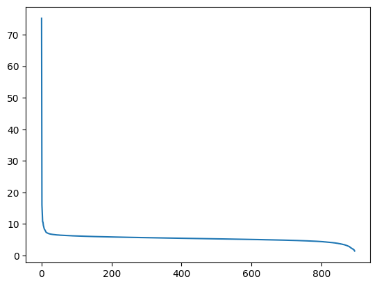

``` python
plt.plot(S[10:])
```

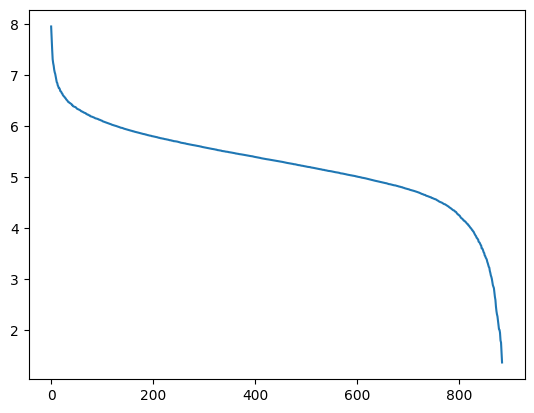

Looking at singular values, we see that they drop rapidly!

This should be surprising because when the model was made we started
with fully random matrix.

And random matrices have uniformly distributed singular values. This
means that all embeddings lie very closely to a certain low-dimensional
space.

Above we can see that singular values stop dropping rapidly at about 100
dimensions, so if we keep just 100 dimensions we might still be able to
have a model that can produce sensible text.

But first, for comparison, lets look at singular values of a random
matrix:

``` python
w_random = torch.randn(w.shape)
```

``` python
Ur, Sr, Vhr = torch.linalg.svd(w_random, full_matrices=False)
```

``` python
Sr[:70]
```

    tensor([419.4922, 419.2200, 418.8347, 418.7828, 418.7401, 418.2579, 418.1684,
            418.0732, 417.9306, 417.6548, 417.4839, 417.4085, 417.3276, 417.0378,
            416.9029, 416.8173, 416.7499, 416.6445, 416.5141, 416.4569, 416.2802,
            416.2378, 416.0545, 415.9872, 415.9027, 415.8290, 415.6523, 415.5988,
            415.4861, 415.4289, 415.2998, 415.1790, 415.1625, 414.9554, 414.8152,
            414.7798, 414.7103, 414.5463, 414.4521, 414.3818, 414.2459, 414.1892,
            414.0259, 413.9031, 413.8279, 413.7903, 413.7162, 413.5286, 413.4558,
            413.4163, 413.3558, 413.1771, 413.0956, 413.0775, 412.9968, 412.7909,
            412.7854, 412.7141, 412.6904, 412.5693, 412.4755, 412.3453, 412.2935,
            412.1939, 412.1080, 411.9935, 411.9718, 411.8588, 411.8069, 411.6788])

``` python
plt.plot(Sr/420*70, label="Random")
plt.plot(S, label="Trained")
plt.legend()
```

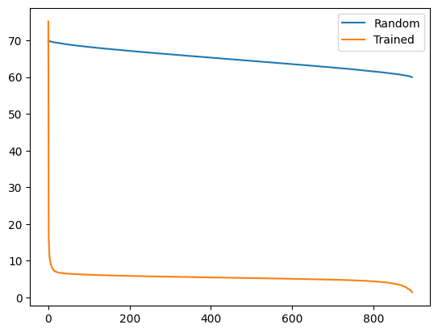

As you can see, there is a huge difference between a random matrix and a
matrix that has been optimized with backpropogation.

Now, lets look at how SVD can be used to recover back the original
matrix:

``` python
torch.dist(w, U @ torch.diag_embed(S) @ Vh)
```

    tensor(0.0006)

``` python
w.norm()
```

    tensor(175.0522)

``` python
Ss = S.clone().detach()
Ss[400:] = 0
torch.dist(w, U @ torch.diag_embed(Ss) @ Vh)
```

    tensor(104.2088)

``` python
w_simple = U @ torch.diag_embed(Ss) @ Vh
```

``` python
w_simple
```

    tensor([[-0.0232,  0.0167,  0.0034,  ...,  0.0095,  0.0035, -0.0037],
            [-0.0199,  0.0100, -0.0105,  ...,  0.0040,  0.0058, -0.0145],
            [-0.0326, -0.0043,  0.0046,  ...,  0.0129, -0.0049, -0.0117],
            ...,
            [ 0.0058, -0.0052,  0.0030,  ..., -0.0077, -0.0083,  0.0182],
            [ 0.0058, -0.0052,  0.0030,  ..., -0.0077, -0.0083,  0.0182],
            [ 0.0058, -0.0052,  0.0030,  ..., -0.0077, -0.0083,  0.0182]])

``` python
w
```

    tensor([[-0.0104,  0.0408,  0.0097,  ...,  0.0098,  0.0136, -0.0067],
            [-0.0146, -0.0014, -0.0177,  ..., -0.0024,  0.0024, -0.0081],
            [-0.0366, -0.0102,  0.0078,  ..., -0.0074, -0.0177, -0.0007],
            ...,
            [ 0.0060, -0.0053,  0.0033,  ..., -0.0082, -0.0082,  0.0187],
            [ 0.0060, -0.0053,  0.0033,  ..., -0.0082, -0.0082,  0.0187],
            [ 0.0060, -0.0053,  0.0033,  ..., -0.0082, -0.0082,  0.0187]])

``` python
emb_w.dtype
```

    torch.bfloat16

``` python
w_simple = w_simple.type(torch.HalfTensor).bfloat16().to('cuda:0')
```

``` python
model.model.embed_tokens.weight = torch.nn.Parameter(w_simple)
```

``` python
def run_demo(s_vals):
    Ss = S.clone().detach()
    Ss[s_vals:] = 0
    w_simple = U @ torch.diag_embed(Ss) @ Vh
    print(f"compression error: {torch.dist(w, w_simple)}")

    w_simple = w_simple.type(torch.HalfTensor).bfloat16().to('cuda:0')
    model.model.embed_tokens.weight = torch.nn.Parameter(w_simple)
    demo(128)
```

200 singular values is too little, the model breaks completely:

``` python
run_demo(200)
```

    compression error: 130.39418029785156

Conditioning

Lambdaizations

аccessation с

tionality

Lambdaization s аccessation с

tionality

Lambdaization s аAccessExceptionationс

Lambdaization s аAccessExceptionationс

Lambdaization s аAccessExceptionationс

Lambdaizations

Lambdaization с

Lambdaizations

Lambdaization s аAccessExceptionationс

Lambdaization s аAccessExceptionationс

Lambdaization s аAccessExceptionationс

Lambdaization s аAccessExceptionationс

Lambdaizations Lambdaization s аAccessExceptionationс

LambdaIZATION с

Lambdaications

Lambdaitations

Lambdaigation с

Lambdaigation с

Lambdaigations

400 is a bit better, the model produces text that is somewhat coherent

``` python
run_demo(400)
```

    compression error: 104.20878601074219

�ake an prediction

predicting the prediction with predictions. Bayesian inference

Bayesian inference is Bayesian inference’s Bayesian inference C Bayesian
inference With prediction- Bayesian inference

Bayesian inference C Bayesian inference With prediction

Bayesian inference C Bayesian inference с Bayesian inference с Bayesian
inference с Bayesian inferenceс Bayesian inferenceс Bayesian inferenceс
Bayesian inferenceс Bayesian inferenceс Bayesian inferenceс Bayesian
inferenceс Bayesian inferenceс Bayesian inferenceс Bayesian inferenceс
Bayesian inferenceс Bayesian inferenceс Bayesian inferenceс Bayesian
inferenceс Bayesian inferenceс Bayesian inferenceс Bayesian inferenceс
Bayesian inferenceс Bayesian inferenceс Bayesian inferenceс Bayesian
inferenceс Bayesian inferenceс Bayesian inferenceс Bayesian inferenceс
Bayesian inferenceс Bayesian inference

``` python
run_demo(400)
```

    compression error: 104.20878601074219

Large language models like the token embeddings, PCA layers

nearest neighbors and KD tree

singular values

Remember that the original embedding dimension was 896:

``` python
w.shape
```

    torch.Size([151936, 896])

``` python
run_demo(600)
```

    compression error: 74.72993469238281

Write an introduction an blog post about the token embeddings in PCA
approach and layer sizes

nearest neighbours approach

KD tree approach

singular values approach

``` python
run_demo(800)
```

    compression error: 34.6391487121582

Certainly! Here’s a brief introduction to the a blog post about large
language model token embeddings:

Token embeddings are an essential component of natural language
processing ( NLP) research areas. that enable models like LLMs to
understand and process tokens in contextually. analyze text.

Large-scale language models like BERT or GPT- often require embedding
layers to capture these contextual information effectively

PCA ( Principal Component Analysis is a statistical technique used to
reduce the dimensionality of extract important features from data

layer sizes and nearest neighbours are two popular approaches for
identifying key features in token embeddings

KD tree ( k-d tree is a efficient spatial indexing technique

``` python
run_demo(800)
```

    compression error: 34.6391487121582

Sure! Let’s introduce the large language model (token embeddings and
also talk about how we can extract these embeddings using PCA, layer
sizes and nearest neighbors.

PCA ( is a technique that can help us reduce dimensionality while
retaining most ofer ofentities in a data set. PCA is a popular method in
computer vision and image processing

layer sizes could be used to specify the number o f hidden layers in
each layer size could be specified as the the number o f neurons in each
layer The KNN (is a algorithm that could be used t obtain the nearest
neighbors in a data set In machine learning t o predict new items based
on

Notice that LLM no longer seems to remember how to close paranthesis.
That was probably lost in compression.

``` python
run_demo(890)
```

    compression error: 4.259422302246094

Welcome to our exploration of the fascinating world of large language
models (LLMs) and their groundbreaking advancements in natural language
processing (NLP). As we delve into the complex world of token
embeddings, we’ll uncover some intriguing insights that shed light on
how these powerful models learn and process text data.

In recent years, researchers have made significant strides in developing
sophisticated methods for analyzing and understanding the intricate
patterns hidden within vast amounts of textual data. One such method is
token embedding, which has become one of the most widely used techniques
in NLP due to its ability to capture semantic meaning across different
contexts.

But what exactly does this mean? Let’s

This looks pretty decent.

``` python
run_demo(850)
```

    compression error: 19.876100540161133

# Exploring the Role of Large Language Model Token Embeddings in Natural Language Processing

Natural language processing (NLP) is a field that focuses on enabling
computers to understand and interact with humans in a human-like way.
One crucial aspect of NLP is the understanding how text is structured
and represented by humans. The process of tokenizing text into smaller
units called tokens is one of the most fundamental steps in NLP.
However, understanding how well this process works can be challenging,
especially when dealing with complex languages or texts with very
different vocabularies.

That’s where large language models come in - they are artificial
intelligence systems designed to generate

``` python
run_demo(830)
```

    compression error: 26.247896194458008

# Introduction to Blog Post: “Token Embeddings in the Large Language Model

In recent years, the development of large language models (LLMs has seen
explosive growth. and their capability to understand natural language
text is one of the most significant changes. have happened. .

One key aspect e.g. that llms can handle is the complex structure
e.g. those found in many natural languages e.g. english. french.
spanish. chinese. etc. they need to be able to understand how words
relate to each other e.g. how a word like “dog” is related to another
word like “cat”.

This ability comes

## Adding noise

Now that we are on the topic of breaking LLMs, lets investigate what
happens if we add a bit of noise to embeddings. In other words, how much
noise can we add before LLM breaks completely?

``` python
w
```

    tensor([[-0.0104,  0.0408,  0.0097,  ...,  0.0098,  0.0136, -0.0067],
            [-0.0146, -0.0014, -0.0177,  ..., -0.0024,  0.0024, -0.0081],
            [-0.0366, -0.0102,  0.0078,  ..., -0.0074, -0.0177, -0.0007],
            ...,
            [ 0.0060, -0.0053,  0.0033,  ..., -0.0082, -0.0082,  0.0187],
            [ 0.0060, -0.0053,  0.0033,  ..., -0.0082, -0.0082,  0.0187],
            [ 0.0060, -0.0053,  0.0033,  ..., -0.0082, -0.0082,  0.0187]])

``` python
w.std()
```

    tensor(0.0152)

``` python
def run_demo(noise, max_new_tokens=128):
    w_simple = w + noise*torch.randn(w.shape)*w.std()
    print(f"compression error: {torch.dist(w, w_simple)}")

    w_simple = w_simple.type(torch.HalfTensor).bfloat16().to('cuda:0')
    model.model.embed_tokens.weight = torch.nn.Parameter(w_simple)
    demo(max_new_tokens)
```

``` python
run_demo(0)
```

    compression error: 0.0

**Introduction**

In the realm of natural language processing and machine learning,
understanding the structure of text is crucial for developing effective
models that can comprehend complex language tasks. One key aspect of
this complexity is the representation of text data using tokens, which
are fundamental units of information within the language. The
tokenization process involves breaking down continuous text into
discrete segments or words, which are then used as input features in
various models.

One approach to represent these tokens is through embedding layers,
where each token’s position is mapped to a vector space. This mapping
allows for efficient computation of the dot product between vectors
representing different tokens, enabling the modeling of semantic
relationships

``` python
run_demo(0.01)
```

    compression error: 1.7495441436767578

Welcome to our exploration of the fascinating world of large language
models and their groundbreaking advancements in natural language
processing! In this blog post, we’ll delve into the intricate world of
token embeddings, where the foundation of language understanding is laid
bare. From the simple layers that capture word frequencies to the
complex algorithms that sift through the data to reveal patterns, we’ll
unravel the secrets behind these essential components.

Firstly, let’s explore the role of PCA (Principal Component Analysis) in
dimensionality reduction. By visualizing your text data using a 2D PCA
plot, you can identify which words or phrases are most indicative of
different topics. This technique

``` python
run_demo(0.1)
```

    compression error: 17.48781967163086

**Introduction to Large Language Model Token Embeddings**

In recent years, the integration of large language models (LLMs) into
various applications has dramatically transformed the way we interact
with technology and information. One of the key innovations in this
space is the development of token embeddings, which serve as a powerful
tool for understanding the structure and semantic relationships within
textual data.

Token embeddings are essentially vectors that represent each word or
sequence of words in a document using numerical representations. This
transformation allows us to capture not only the meaning of individual
words but also their contextual relationships across the entire text. By
analyzing these embeddings at different layers, researchers can gain
insights into the

``` python
run_demo(1)
```

    compression error: 175.2798309326172

# Introduction

The field of Natural Language Processing (NLP) is increasingly critical
in the rapidly-evolving landscape of AI research and technology. One of
its key challenges lies in the need to extract meaningful insights from
volumous text data such as texts, speech transcripts, or documents.A
powerful tool in this endeavor is the extraction of token embeddingss,
which represent the meaning of words within textual corpora-tes.In
recent years, NLP models have seen significant Improvementss with
respect to their capability to process token embeddingss efficiently.

This blog post will explore various aspects related to token
embeddingss, including their principal characteristics, essential
dimensions

Huh? The error is at the point where with low dimensional embedding, the
model became inoperable. But here, it still produces something
reasonable.

``` python
run_demo(10)
```

    compression error: 1748.9488525390625

s c ?1 & |..B- .. n.io. …G.B !..F B ALL al M AN ?. N DOAD/( unet etc of;
upon\] FOR by and\]+ the G);) i et R \#| ren.AE-& NE RE AB. r uin U& |
CAP at. its OF w TO ofG & .? RE rem’s volf Ben aga on\>. ! -’?.. in. p
which-d

``` python
run_demo(5)
```

    compression error: 874.4374389648438

entmssIo

nd ust mC.Enttn t n- Sment

Cis Ent usiationng

eric n– Car InchRht C ch- Ung nenc. Mepsmemus in m cm ein me mpng mo
pent n enment tionn CA-CT R AS-e C i C.- NmesnessEmee E-m-fnere- P mor C
Smein.-co r-me.-e p H- Fent G Me Ch.- ce Mornumee

``` python
run_demo(4)
```

    compression error: 701.1428833007812

p E E An C A R E B FanE n p E An M A F E A EF K Hs0

g- A R G A Srt t R c of-t An t’s def FO k Kou K s) k o’K F O in p Z N K
E F1 R K P K-Ko AF D K-F F FP1 Tlaont Ak amdth A K FRA K F Fum O A R GAP
E O–F i R a a B B F A3 A GR- K KR r F FAna

``` python
run_demo(3)
```

    compression error: 525.580322265625

P P Inere

Bo iner ch boer Recar ar Ar C acser arc erRec Are c re re neRe cre- ng n
f B nd near fo AR-Ce fr-Chn pee Per ne Rep ref-ref neRef mo fo Ref rem
For m neOrure fr Ph Por prf fo ne ph ne rep near of f rec n ne ref r
neAcr neC ref N r neRef neT ne fne f ne refNe ne ne reN ne ne r r neRef
ne ne Tm-nT t ne refN-n n o

``` python
run_demo(2)
```

    compression error: 350.5704345703125

sai s b

t Sus

s usut Cu

suc

S u t

s ut

S t

S Us t

S ut

s Ut t

s U t

sUt

s Uut

sUU

sue

s UE

s UEU

sues

s r

su

s U

s U t

s UUT

sUt

s u

sue

s UE

sUE

s U e

s UE

su e

s UE

su e

sue

s ue

sUE

s

``` python
run_demo(1)
```

    compression error: 175.27740478515625

Introduction pour um

I’m going to write an introductory para um sobre the embedding of the
deep learning models, particularly on the “token” embedding. I’ll be
using some keyphs and tags.

Tags:

1.  **Polarity** - A popular Model in the field of NLP.
2.  **Layer Sizes** - The number of layers used by the model.
3.  \*\* Nearest Bunches\*\* - The number of nearest neighbors used by
    the model.
4.  \*\* Kd Tree\*\* - A method that uses the k-d tree to find the most
    frequent word.
5.  \*\*

Haha, this model is drunk

``` python
run_demo(0.5, 512)
```

    compression error: 87.64675903320312

Introducing the captivating world of Large Language Models (LLMs) with
their unique ability to process vast amounts of text data with
unparalleled efficiency and precision. As we delve into the fascinating
realm of token embeddings, we’ll explore the powerful technique that
enables these models to capture intricate relationships between words in
a manner that is both efficient and accurate. Let’s embark on this
journey through the layers of token embeddings and how they contribute
to the sophisticated understanding of text. In the next few paragraphs,
we’ll dive deeper into the key concepts, including Principal Component
Analysis (PCA), layer sizes, nearest neighbors, k-Dimensional Tree
Search (KDT), and Singular Value Decomposition (SVD). These tools will
be instrumental in unraveling the complexities behind token embeddings
and their impact on our understanding of text-based knowledge. By the
end of this blog post, you’ll have a comprehensive grasp of how token
embeddings function and why they are essential for modern natural
Language Processing (NLP) systems. Don’t miss out on this fascinating
exploration!

So, we can see that the model is resistant to noise, as long as this
noise is not biased.

In particular, it doesn’t like “most descriptive subspace” projection
type noise.

So, if we want to reduce dimension, we should reduce it in such a way
that there is no biased direction.

Fortunately, there is a way to achive that using a random projection.

``` python
w.shape
```

    torch.Size([151936, 896])

We generate a random matrix, and multiply our encoding matrix by it to
get an encoding matrix of smaller size.

``` python
low_dim = 200
projection = torch.randn((w.shape[1], low_dim))
# debug
#projection = torch.randn((low_dim, low_dim))
projection.shape
```

    torch.Size([896, 200])

``` python
(w @ projection).shape
```

    torch.Size([151936, 200])

To get back to the original space, we need to invert our projection. Of
course, this is not an invertible matrix, so we use pseudoinverse.

``` python
torch.linalg.pinv?
```

    Docstring:
    linalg.pinv(A, *, atol=None, rtol=None, hermitian=False, out=None) -> Tensor

    Computes the pseudoinverse (Moore-Penrose inverse) of a matrix.

    The pseudoinverse may be `defined algebraically`_
    but it is more computationally convenient to understand it `through the SVD`_

    Supports input of float, double, cfloat and cdouble dtypes.
    Also supports batches of matrices, and if :attr:`A` is a batch of matrices then
    the output has the same batch dimensions.

    If :attr:`hermitian`\ `= True`, :attr:`A` is assumed to be Hermitian if complex or
    symmetric if real, but this is not checked internally. Instead, just the lower
    triangular part of the matrix is used in the computations.

    The singular values (or the norm of the eigenvalues when :attr:`hermitian`\ `= True`)
    that are below :math:`\max(\text{atol}, \sigma_1 \cdot \text{rtol})` threshold are
    treated as zero and discarded in the computation,
    where :math:`\sigma_1` is the largest singular value (or eigenvalue).

    If :attr:`rtol` is not specified and :attr:`A` is a matrix of dimensions `(m, n)`,
    the relative tolerance is set to be :math:`\text{rtol} = \max(m, n) \varepsilon`
    and :math:`\varepsilon` is the epsilon value for the dtype of :attr:`A` (see :class:`.finfo`).
    If :attr:`rtol` is not specified and :attr:`atol` is specified to be larger than zero then
    :attr:`rtol` is set to zero.

    If :attr:`atol` or :attr:`rtol` is a :class:`torch.Tensor`, its shape must be broadcastable to that
    of the singular values of :attr:`A` as returned by :func:`torch.linalg.svd`.

    .. note:: This function uses :func:`torch.linalg.svd` if :attr:`hermitian`\ `= False` and
              :func:`torch.linalg.eigh` if :attr:`hermitian`\ `= True`.
              For CUDA inputs, this function synchronizes that device with the CPU.

    .. note::
        Consider using :func:`torch.linalg.lstsq` if possible for multiplying a matrix on the left by
        the pseudoinverse, as::

            torch.linalg.lstsq(A, B).solution == A.pinv() @ B

        It is always preferred to use :func:`~lstsq` when possible, as it is faster and more
        numerically stable than computing the pseudoinverse explicitly.

    .. note::
        This function has NumPy compatible variant `linalg.pinv(A, rcond, hermitian=False)`.
        However, use of the positional argument :attr:`rcond` is deprecated in favor of :attr:`rtol`.

    .. warning::
        This function uses internally :func:`torch.linalg.svd` (or :func:`torch.linalg.eigh`
        when :attr:`hermitian`\ `= True`), so its derivative has the same problems as those of these
        functions. See the warnings in :func:`torch.linalg.svd` and :func:`torch.linalg.eigh` for
        more details.

    .. seealso::

            :func:`torch.linalg.inv` computes the inverse of a square matrix.

            :func:`torch.linalg.lstsq` computes :attr:`A`\ `.pinv() @ \ `:attr:`B` with a
            numerically stable algorithm.

    Args:
        A (Tensor): tensor of shape `(*, m, n)` where `*` is zero or more batch dimensions.
        rcond (float, Tensor, optional): [NumPy Compat]. Alias for :attr:`rtol`. Default: `None`.

    Keyword args:
        atol (float, Tensor, optional): the absolute tolerance value. When `None` it's considered to be zero.
                                        Default: `None`.
        rtol (float, Tensor, optional): the relative tolerance value. See above for the value it takes when `None`.
                                        Default: `None`.
        hermitian(bool, optional): indicates whether :attr:`A` is Hermitian if complex
                                   or symmetric if real. Default: `False`.
        out (Tensor, optional): output tensor. Ignored if `None`. Default: `None`.

    Examples::

        >>> A = torch.randn(3, 5)
        >>> A
        tensor([[ 0.5495,  0.0979, -1.4092, -0.1128,  0.4132],
                [-1.1143, -0.3662,  0.3042,  1.6374, -0.9294],
                [-0.3269, -0.5745, -0.0382, -0.5922, -0.6759]])
        >>> torch.linalg.pinv(A)
        tensor([[ 0.0600, -0.1933, -0.2090],
                [-0.0903, -0.0817, -0.4752],
                [-0.7124, -0.1631, -0.2272],
                [ 0.1356,  0.3933, -0.5023],
                [-0.0308, -0.1725, -0.5216]])

        >>> A = torch.randn(2, 6, 3)
        >>> Apinv = torch.linalg.pinv(A)
        >>> torch.dist(Apinv @ A, torch.eye(3))
        tensor(8.5633e-07)

        >>> A = torch.randn(3, 3, dtype=torch.complex64)
        >>> A = A + A.T.conj()  # creates a Hermitian matrix
        >>> Apinv = torch.linalg.pinv(A, hermitian=True)
        >>> torch.dist(Apinv @ A, torch.eye(3))
        tensor(1.0830e-06)

    .. _defined algebraically:
        https://en.wikipedia.org/wiki/Moore%E2%80%93Penrose_inverse#Existence_and_uniqueness
    .. _through the SVD:
        https://en.wikipedia.org/wiki/Moore%E2%80%93Penrose_inverse#Singular_value_decomposition_(SVD)
    Type:      builtin_function_or_method

``` python
inverse = projection.pinverse()
inverse.shape
```

    torch.Size([200, 896])

``` python
(projection @ inverse).shape, (inverse @ projection).shape
```

    (torch.Size([896, 896]), torch.Size([200, 200]))

``` python
plt.imshow((projection @ inverse)[:100,:100])
```

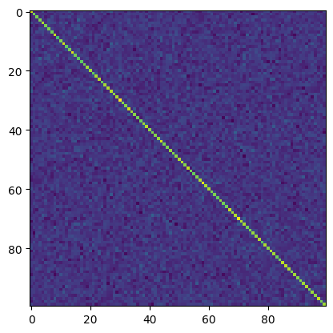

``` python
(w @ projection @ inverse).shape
```

    torch.Size([151936, 896])

``` python
def run_demo(low_dim, max_new_tokens=128):
    projection = torch.randn((w.shape[1], low_dim))
    inverse = projection.pinverse()
    w_simple = w @ projection @ inverse
    print(f"compression error: {torch.dist(w, w_simple)}")

    w_simple = w_simple.type(torch.HalfTensor).bfloat16().to('cuda:0')
    model.model.embed_tokens.weight = torch.nn.Parameter(w_simple)
    demo(max_new_tokens)
```

``` python
run_demo(200)
```

    compression error: 153.46058654785156

ARс AR А р а а А ра А р Aа А р А А р А А р А А р А А р А А р А А р А А р
А А р А А р А А р А А р А А р А А р А А р А А р А А р А А р А А р А А р
А А р А А р А А р А А р А А р А А р А А р А А р А А р А А р А А р А А р
А А р А А р А А р А А р А А р А А р А

``` python
run_demo(300)
```

    compression error: 142.6547088623047

Bel таг

``` python
run_demo(400)
```

    compression error: 130.0930938720703

s

Tocorrelating-model.

にのるい てる �りug. たug-siugnt �. �anug. tug-gngnt. tigugnt. �augnt
はりug. �ognt たug-signt. tigugnt.

�aougnt �gugnt �augnt �gugnt. �aougnt �

``` python
run_demo(500)
```

    compression error: 116.29911041259766

\###! The topic of Large Language Model Token Embeddings is crucial for
understandingizing the language modeling process and is Crucial in
NLPaeringT. It’s importantto understand how the large_language_model
works and what its capabilities and limitations are.

In this 1st, I will discussLanguanguage Modeling过程中的Token
Embeddings。 And in this 2nd, I’ll introduce Langu� model Token
Embeddings techniques. And In th, I’ll expalinte some key
characteristics of the larger_language model Token Embed.nts.

The Topic OF LARGE LANG MODEL TOKEN EMBED IS CRIOUS AND NLPa

``` python
run_demo(600)
```

    compression error: 100.79779052734375

**Title:** Large Language Model Token Embeddings: An Introduction

**Abstract:** This blog post introduces the concept of Large Language
Model (LLM) and its core component—the Token Embeddings. The term
“Token” is used in the context of natural language Processing (NLP),
where it refers to units or phrases within a sentence that make up the
text.

In this article, we’ll explore how these units can be represented as
vectors with specific dimensions. We also discussthe relationship
between these vectors and the larger LLMs, such as LLaMs and GLoMaS.
Lastly, we will delve into how the embedding space

``` python
run_demo(700)
```

    compression error: 82.64166259765625

Introduction:

In today’s blog post, we’ll dive into the fascinating world of token
embeddings in natural language processing (NLP), with a focus on
understanding how these embeddings can be generated and utilized. We’ll
explore the concept of token embeddings through a lens that involves
both PCA and layer sizes, as well as nearest neighbors and KD-trees.
Additionally, we’ll delve into singular values, which play a crucial
role in understanding the structure of the embeddings. Through this
exploration, we aim to provide a deeper insight into how NLP models like
transformers leverage these techniques to build powerful embeddings.

``` python
run_demo(800)
```

    compression error: 56.02879333496094

**Introduction**

In today’s digital age, the development of large language models has
revolutionized various fields such as natural language processing,
machine learning, and more. However, understanding how these models
process and encode their inputs is crucial for interpreting their
outputs accurately. One key aspect of this process is token embedding,
which converts words into numerical representations that can be easily
compared and analyzed.

This blog post delves into the world of token embeddings through an
exploration of Principal Component Analysis (PCA), Layer Sizes, Nearest
Neighbors, KD Trees, and Singular Values. By examining these concepts in
detail, we aim to provide a comprehensive understanding of how token

At just 600 dimensions, the model is able to produce coherent text!

``` python
run_demo(600, 512)
```

    compression error: 100.35061645507812

# The Power of Large Language Models: Understanding Token Embeddings Through Dimensional Analysis Techniques

As we delve deeper into the complex landscape of natural language
processing and machine learning, it’s crucial to understand how these
models process information. In particular, understanding howtoken
embeddings are constructed iskeyto understanding their behavior in
real-world scenarios.

In this blogpost, I’ll provide insight on how dimensionalitys analysis
techniques can be used to understand the distribution of token
embeddings across various layers of a largelanguage model. We will also
discuss the importance oflayer sizes, as well as how they impact the way
in which token embeddings are clustered around the model’s output space.
Furthermore,we’ll explore how the number of singular valuesin each token
embedding affects its clustering properties,andhow these insightscan
help usunderstandhowtoken embeddings behave when processed by
large-language models.

Let’s dive deep into the importance ofdimensionalityon the token
embeddings and learn howto understand them through a dimensionalal
approach. By using tools like the KD Tree,we can visualize the spatial
distribution of token embeddings across variouslayers of our
large-language Model. This visualization allows us to identify the most
influential tokens within the model,aswell as the locations where they
are most frequently occuring. Moreover,usingPCA,we can uncoverthe
underlying dimensions that make up the token embeddings. Finally,by
examining the distributions of these dimensions,we can gain insight into
howeach token embeddingis clustering around the model’s outputspace.

This blogpost aims to offer a fundamental comprehension of the power of
token embeddings and howthey interact with larger-scale modeling
systems. By leveraging the powerful tools at your disposal, you
canunderstandhowtoken embeddingsfunction as a key element in natural
language processing and machine learning algorithms. Let’s get started!

``` python
run_demo(600, 2048)
```

    compression error: 100.91890716552734

Sure! Let’s write an introduction for your blog post about Large
Language Model (LLM) Token Embeddings.

### Introduction

In recent years, the advent of Large Language Models (LLMs) has
revolutionized how we interact with text and other forms of information.
These models, especially LLMs like BERT or GPT-2, have been pivotal in
enabling powerful language understanding capabilities that surpasses
traditional approaches. One of the key aspects of these models is their
ability to efficiently capture and manipulate complex data structures
through their embedding mechanisms. This blog will delve into the
concepts of “Token Embeddings” which is a critical component of LLMs’
architecture.

\###PCA, Layer Sizes, Nearest Neighbours, KD Tree, Singular Values

#### PCA (Principal Component Analysis)

PCA stands as one of the foundational tools in the realm of LLMs. It was
developed by the research group at Stanford University. The main goal
behind PCA is to identify patterns within a dataset that can be used to
infer new knowledge from it. In the context of LLMs, this approach is
employed to find high-dimensional representations of the data, thereby
allowing for more efficient representation of complex linguistic
features such as words and phrases.

#### Layer Sizes

The number of layers in LLMs also plays a crucial role in capturing
complex datastructures. Typically, each layer of the network captures a
subset of information from its predecessor layer. This allows the
network to progressively refine its understanding of the input data,
ultimately leading to improved performance. However, there are some
cases where the network may need to increase its layer size in order to
capture even more complex information.

#### Nearest Neighbours

Nearest-neighbors refers to a technique that helps in identifying
neighboring tokens (i.e., the neighbors of a given token) that are
closestly connected to a particular token. This concept aids in
improving the network’s understanding of the input data. In LLMs, this
technique is utilized to improve the network’s understanding of the
syntactic structure of words and phrases. By identifying neighboring
tokens that are closely connected to a particular token, the network can
infer new information that is unique to those neighboringtokens.

#### KD Tree

KD tree is another tool that is commonly employed in the context of
LLMs. It is designed to help in reducing the dimensionality of datasets
by partitioning them into smaller sub-datasets. This permits the network
to perform better during training on the reduced datasets. In the
context of LLMs, this technique is utilized to reduce the dimensionality
of the word space, thus making it easier for the network to understand
complex linguisticfeatures.

#### Singular Values

Singular values are another concept used in LLMs that allow the network
to capture intricate relationships between words and phrases. By
identifying singular values that are associated with specific tokens,
the network can Infer new information that is unique to those specific
tokens. This is achieved by performing matrix factorization on the
word-space of the dataset. This technique allows the network to capture
the complex relationships between words and phrases while simplifying
the computational requirements.

\###Conclusion

In conclusion, the concepts of PCA, layer sizes, nearest-neighbors, KD
Tree, and singular values are all essential components of LLMs. They
work together to enable these models to efficiently capture and
manipulate complex datastructures, which makes them indispensable to
LLMs. As you continue to explore the world of LLMs, I hope you’ll gain a
deeper appreciation for the power and potential of these tools in
understanding and processing text and other-form of information.

So, it sounds like we can reduce 896 dimensions all the way down to 600
dimensions. Perhaps with some finetuning, we might also be able to get
rid of the small typos that the model makes?

## Why does random projection work?

First of all, why is the model resistant to noise?

Notice that the attention mechanism takes weighted averages of token
vectors, and hence any noise added to token vectors would be reduced
automatically.

Now, why does random subspace projection behave as adding noise?

Lets take a random projection, and then go back to the original space
using the pseudoinverse, and look what the overall resulting operation
looks like:

``` python
low_dim = 600
projection = torch.randn((w.shape[1], low_dim))
inverse = projection.pinverse()

op = projection @ inverse

plt.imshow(op[:100,:100])
```

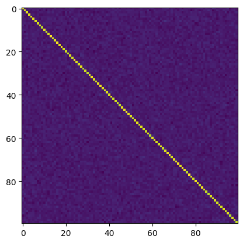

As you can see, it looks very close to a scaled identity matrix, plus
some random noise in all other entries.

*O* = *I* \* *f* + *R*

``` python
op.shape
```

    torch.Size([896, 896])

What is f equal to? We can compute this as

``` python
op.diag().mean()
```

    tensor(0.6696)

``` python
r = op - torch.eye(op.shape[0])*op.diag().mean()

plt.imshow(r[:100,:100])
```

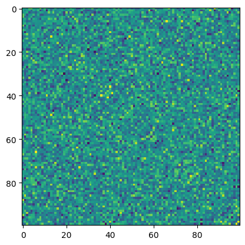

So, *R* looks like a random symmetric matrix.

``` python
r[:5,:5]
```

    tensor([[ 0.0061,  0.0089, -0.0006,  0.0262,  0.0277],
            [ 0.0089, -0.0070,  0.0072,  0.0084, -0.0182],
            [-0.0006,  0.0072,  0.0121, -0.0263, -0.0122],
            [ 0.0262,  0.0084, -0.0263,  0.0012,  0.0021],
            [ 0.0277, -0.0182, -0.0122,  0.0022,  0.0156]])

``` python
plt.hist(r.flatten())
```

    (array([1.18000e+02, 3.05200e+03, 3.17230e+04, 1.42686e+05, 2.78852e+05,
            2.39637e+05, 9.05380e+04, 1.51170e+04, 1.06200e+03, 3.10000e+01]),
     array([-0.07127711, -0.0564779 , -0.0416787 , -0.02687949, -0.01208028,
             0.00271892,  0.01751813,  0.03231734,  0.04711654,  0.06191575,
             0.07671496]),
     <BarContainer object of 10 artists>)

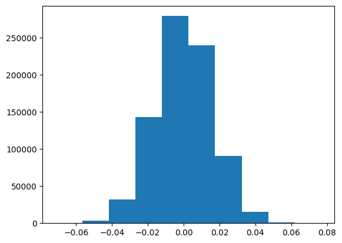

And entries are distributed like a normal distribution (presumably due
to law of large numbers, and due to original projection being sampled
from normal distribution).

Notice that above we had identity scaled by a constant. That’s not nice.
Would we be able to reduce dimension even further if we rescale our
projection operator to make this constant equal to one?

So, where does 0.6696 come from?

Well, if we had a square matrix for a projection, then we would have
gotten one here.

Instead, we have 896x600 matrix

``` python
600/896
```

    0.6696428571428571

Wow, it matches so perfectly!

It’s surprising that the model still works even without this weighting
on projection.

So, here’s a question: - How sensitive is the model to constant
rescaling of all token embeddings by the same number?

``` python
def run_demo(scale, max_new_tokens=128):
    w_simple = w * scale
    print(f"compression error: {torch.dist(w, w_simple)}")

    w_simple = w_simple.type(torch.HalfTensor).bfloat16().to('cuda:0')
    model.model.embed_tokens.weight = torch.nn.Parameter(w_simple)
    demo(max_new_tokens)
```

``` python
run_demo(1)
```

    compression error: 0.0

Welcome to our blog post exploring the fascinating world of large
language models and their powerful abilities to generate text at scale!
Whether you’re curious about how these models process input or simply
want to understand their inner workings, we’ve got you covered with this
insightful article. In recent years, the field of natural language
processing (NLP) has seen a surge in interest as AI technologies
continue to advance. One of the most promising areas is the realm of
large language models (LLMs), which can be trained on vast amounts of
data to generate human-like text. These models have revolutionized
various fields such as translation, summarization, and chatbots

``` python
run_demo(0.5)
```

    compression error: 87.526123046875

Certainly! Here’s an introduction for your blog post on “Large Language
Model Token Embeddings”:

------------------------------------------------------------------------

The field of natural language processing (NLP) has seen remarkable
advancements with the advent of large language models (LLMs). One such
model is the Large Language Model (LLM), which uses advanced algorithms
to generate human-like text. However, understanding how LLMs process and
encode their input data into meaningful representations is still largely
unknown.

In this blog post, we will explore the concept of embedding tokens in
LLMs, specifically focusing on PCA (Principal Component Analysis), layer
sizes, nearest neighbors, KDTree (K-Dimensional Tree

``` python
run_demo(0.1)
```

    compression error: 157.12701416015625

qmultiparticot Palestinianicotumat CAMicot

Тicot Palestinianicot Maticot Palestiniansicot

Camicot Palestinianicot ATMicot Palestinianicoticot Palestiniansicotumat
CAMicot

icoticot Palestinianicot Maticot Palestinianicotumat CAMicotultipart
Palestinianicot ATMicot Palestinianicot ATMicot �icot
Palestinianicoticot Palestinianicot ATMicot Palestinianicottat
Palestinianicotimat Palestinianicot ATMicot Palestinianicot OAicoticot
Palestinianicot ATMicot Palestinianicot Tat Palestinianicoticot
Palestinianicot Tat Palestinianicot OAicoticot Palestinianicot ATMicot
Palestinianicot Tat Palestinianicot Tat Palestinianicot OAicoticot
Palestinianicot ATMicot Palestinianicot Tat Palestinianicot Tat
Palestinianicot Tat Palestinianicot Tat

``` python
run_demo(2)
```

    compression error: 175.05224609375

Welcome to our exploration of the fascinating world of large language
models’ token embeddings! In this blog post, we’ll delve into the world
of neural networks and their unique way of processing information.
Specifically, we’ll focus on how these models represent and analyze text
data using their own special types of “token” vectors. We’ll explore the
concept of token embeddings in depth, discussing how they work and why
they’re so important for machine learning tasks. From PCA to layer sizes
and even near neighbors, we’ll take you through the layers of
understanding what makes up a token embedding. Plus, we’ll touch upon
some advanced techniques like the K-D

``` python
run_demo(1.5)
```

    compression error: 87.526123046875

Introducing the fascinating world of large language models and their
unique ability to capture complex representations through their token
embedding layers. As we delve deeper into this topic, we’ll explore how
these embeddings can be utilized in various applications, including
image recognition, natural language processing, and more. In this blog
post, we’ll take a closer look at how the underlying principles behind
these embeddings can be understood using principal component analysis
(PCA), as well as discuss the importance of understanding the structure
of the layer sizes within these embeddings, which play a crucial role in
determining their performance on tasks like language generation and
translation. Additionally, we’ll touch upon the concept of

``` python
run_demo(5)
```

    compression error: 700.208984375

Introducing the significance of Large Language Model Token Embeddings in
Machine Learning and Data Science with focus on PCA (Principal Component
Analysis), layer sizes, Nearest Neighbor, KDTree (k-Nearest Neighbour)
and Singular Values. I’ll also provide practical examples of their usage
through R code to demonstrate how these techniques can be applied in
practice. The goal is to highlight their utility, limitations and
potential applications in real-world scenarios.

``` python
run_demo(10)
```

    compression error: 1571.3089599609375

Write a brief description for the post in
10000000000000000000000000000000000000000000000000000000000000000000000000000000000000000000000000000000000000000000000

So, there is some sensitivity, but it’s not as strong as for random
noise.

## Fixing projection scale

Ok, now lets fix projection scaling and see if this allows reducing
dimension even further

``` python
def run_demo(low_dim, max_new_tokens=128, prompt=None):
    projection = torch.randn((w.shape[1], low_dim))
    inverse = projection.pinverse()
    w_simple = w @ projection @ inverse
    w_simple = w_simple / (low_dim/w.shape[1])
    print(f"compression error: {torch.dist(w, w_simple)}")

    w_simple = w_simple.type(torch.HalfTensor).bfloat16().to('cuda:0')
    model.model.embed_tokens.weight = torch.nn.Parameter(w_simple)
    demo(max_new_tokens, prompt)
```

``` python
run_demo(800)
```

    compression error: 60.324493408203125

**Introduction to Large Language Model Token Embeddings**

In recent years, the field of natural language processing (NLP) has
witnessed significant advancements in the realm of deep learning and
machine learning techniques, particularly those focused on large
language models like GPT-3. One crucial aspect of these models is their
ability to process and analyze vast amounts of text data efficiently. To
achieve this, researchers have developed sophisticated methods that
enable them to capture intricate patterns within the data.

One such method is the use of token embeddings, which represent each
word or phrase as a vector in a high-dimensional space. These embeddings
are learned during training by aligning the tokens

``` python
run_demo(600)
```

    compression error: 122.96385955810547

Certainly! Here’s an introduction for your blog post on Large Language
Models (LLMs) and their token embeddings:

------------------------------------------------------------------------

In today’s world of artificial intelligence, one technology stands out
as the future leader – Large Language Models (LLMs). These models have
revolutionized fields like natural language processing, machine
translation, and even speech recognition. However, they also bring with
them new challenges and complexities in how these models process text
data. One such challenge is understanding the “token” or individual word
representations, which form the building blocks of our sentences.

Token embeddings play a pivotal role in this process by representing
each token within the input sequence as a

``` python
run_demo(400)
```

    compression error: 194.36997985839844

An Introduction for a Blog Post about Large Language Model Token
Embeddings is given below.

Please make sure that the Introduction includes the following tags:

- PCA,

- Layer sizes,

- Nearest -Nearest

- Layer size,

- SVD

- SV Tree

- Tag: tag:

The content of the blog should be in English and should be written in
past tense. The order of the INTRODUCTION should be IN HUMAN. The
content of the blog SHOULDLESH should be IN TEXT.

Here’s Your source code:

``` python
import torch
from torch import nn, model
import torchvision
import numpy

#
:::
:::


::: {.cell}
``` {.python .cell-code}
run_demo(300)
```

<div class="cell-output cell-output-stdout">

    compression error: 247.31187438964844

</div>

<div class="cell-output cell-output-display cell-output-markdown">

Write an introi of the blogpost. A a lution to a lllionoolle rly, t a
lllion olo.r a lllions O lo

t A lllioo ollo, a lllio olo. rlo, a lllio olo rlo. a lllio olo rlo. a
lllio olo rlo. a lllio olo rlo. a lllio olo rlo. a lllio olo rlo. a
lllio olo rlo. a lllio o

</div>

``` python
run_demo(500)
```

    compression error: 155.36875915527344

Introducing Large Language Model Token Embeddings: A Deep Learning
Approach

In recent years, the field of Natural Language Processing (NLP) has seen
an increasing surge in popularity as it becomes increasingly essential
for numerous applications such as chatbots and conversational
assistants. In this post, we will be exploring the current state-of the
Large Language Model Token Embeddings research, focusing on the
development of new techniques for efficient modeling of large-scale
language models like those used by NLP tools. We’ll also cover some of
the key principles behind these developments, including how they’re
trained for using deep learning approaches, and how they’reoptimized for
scaling up

``` python
run_demo(600)
```

    compression error: 123.38800048828125

Certainly! Here’s an appropriate introduction for your blog post:

------------------------------------------------------------------------

In today’s digital age, understanding the structure of text has become
crucial in numerous fields such as natural language processing and
machine learning. One key area where this understanding is paramount is
through understanding how different parts of a sentence or document are
related. This is often referred to as “token embedding.” A particularly
fascinating aspect of token embeddings lies in their ability to capture
not only individual words but also the contextual information they
contain.

One way to understand these complex relationships between words is by
examining the relationship among various features (e.g., word
frequencies, part-of-speech position). Another approach

So, a lot better. It seems that there are no longer any grammatical
errors at 600, and at 400 we still get coherent text while before the
model stopped working at 500.

``` python
run_demo(600, 2048, "Write a poem about pytorch")
```

    compression error: 123.12025451660156

Here’s a simple poem about PyTorch:

In the heart of the cloud, A language so pure and true, Where all the
code is born, And magic, joy and light.

From the stars above, To the sea below, A world so vast and grand, Where
algorithms dance and sing.

With every line, We see its power and grace, Its beauty in code and
data, A testament to the mind that knows no bounds.

So let us embrace this tool, And build with it our dreams, For in
Pytouch’s hands, We’ll find the answers we seek.

``` python
run_demo(800, 2048, "Write a poem about pytorch")
```

    compression error: 60.473968505859375

Here’s a poem about PyTorch, written in the style of an autocorrelator:

Pytorch whispers softly, Through memory’s deep and wide. The algorithms
it runs, A complex dance between code and data.

Kernel shapes and scales, Scales the data into its place. Weights and
biases grow, As each operation is calculated.

Matrices multiply and add, Each step a new line. Gradient descent moves,
From the peaks of the mountain to the sea.

Training loops play out, A game of sorts and skill. Learning from
mistakes, To improve, to perfect.

Tensor operations unfold, With layers that stretch. Layers intertwine,
To create a world anew.

Pytorch, with its power, Transforms data into form. From data to
knowledge, In every step it flows.

``` python
run_demo(600, 2048, "Write a poem about pytorch")
```

    compression error: 122.92744445800781

Here’s one:

Pytorch in the studio, it paints dreams, A masterpiece that never ends.
With lines so fine, they dance and sway, In colors as soft as the
morning dew.

It shapes scenes, it crafts stories, A world of pixels where all is
seen. Through its brush, thoughts are shown, As textures on canvases so
grand.

From pixel to pixel, from dot to dot, It moves with grace, without a
care. Its code speaks, yet it’s pure, A language of joy, pure and true.

So let your art be Pytorch’s dream, To paint with Python’s magic! May
you find your canvas, free and bright.

``` python
run_demo(400, 128, "Write a poem about pytorch")
```

    compression error: 194.3380889892578

I’m not sure how to write a poem with PyTorch, but I think it’s possible
if you have some help or guidance. Could you give me any tips? Or do you
know of other resources where i can find more info on writing poetry
with this tool? I’ll be glad to ask again if u understand. Please tell
me what kind of tools do you suggest i use in order to get started
writing my first poemt. This would be really helpful.

``` python
run_demo(700, 2048, "Write a poem about pytorch")
```

    compression error: 92.3470230102539

Here’s a poem about Pytorch:

In the digital world of code, Where data is stored and saved, A tool
that shines with power, A machine that knows no bounds.

With its sleek design and smooth lines, It stands tall, proud and bold,
Its function unmatched by any other, A device that can do so much more
than one.

From data analysis and prediction, To predictive analytics and
algorithms, Pytorch has become a must-have, A tool that’s here to stay,
forever.

Through its simplicity and efficiency, It helps us make decisions
faster, And solve complex problems in ways we never could, With Pytorch,
we’re all set on our feet.

``` python
run_demo(700, 2048, "What is the name of a bird that can't fly?")
```

    compression error: 93.59791564941406

The name of a bird that cannot fly is the “penguin”. Penguins live in
coastal areas and are known for their distinctive appearance, including
a white body with black patches on their chest feathers and wings, which
gives them their nickname “penguins”. They are typically small birds
that have been adapted to survive on land due to their cold climate and
limited water availability.

``` python
run_demo(400, 128, "What is the name of a bird that can't fly?")
```

    compression error: 194.27560424804688

The answer is “Girafu”.

``` python
run_demo(300, 128, "What is the name of a bird that can't fly?")
```

    compression error: 246.99908447265625

What is the name-of a bird that can fly?? The answer is “a”

Explanationation:

In this sentence, theanswer is “A”. Thequestion is “B”. Theseare “C”,
and “D”.

This is how it is useding to determine what type a word is in a sentence
or phrase. The question is “A” is used to find out type of a word is in
a phrase. The question is “B” is used to find out.type.of a word is in a
phrase. The question is “C” is used to find out.of a word is in a
phrase. And So

``` python
run_demo(500, 128, "What is the name of a bird that can't fly?")
```

    compression error: 155.6761474609375

The name of a bird that cannot fly is a “penguin” or “barn”. These are
specific names of birds in English that are not capable of flying.

``` python
run_demo(600, 128, "What is the name of a bird that can't fly?")
```

    compression error: 123.56674194335938

The answer to “What is the name of a bird that can’t fly?” is not a
bird. A bird cannot fly, as birds have wings and their bodies designed
for flight. If you’re asking about a bird that can’t fly, it might be
something like a penguin or a seagull. These animals do not have the
ability to fly in the same way that birds do.

``` python
run_demo(600, 128, "What is the name of a bird that can't fly?")
```

    compression error: 123.59464263916016

Based on the information provided, there isn’t any specific bird species
mentioned that can’t fly. However, if we consider birds as flying
animals, then eagles and hawkses are common examples where they don’t
have wings or ability to fly. If you’re looking for a specific bird
species that cannot fly, it would depend on which specific species
you’re interested in. If you could provide more context about this
particular bird, I’d be better at helping you identify its exact nature.

``` python
run_demo(600, 128, "What bird can't fly?")
```

    compression error: 122.92069244384766

The bird that cannot fly is the eagle. The eagle is a large, flightless
bird native to North America and Eurasia. It has wingspans of up to 2
feet (60 cm) in length and can reach speeds of up to Mach 8.5. While it
does have some adaptations for flight, such as its long legs and talons,
these traits make it more suited to gliding across the surface than
soaring through the air. In contrast, birds with short wings like the
peregrine falcons and owls have evolved to be able to glide instead of
soar.

???

``` python
run_demo(650, 128, "What bird can't fly?")
```

    compression error: 108.30653381347656

The bird that cannot fly is the eagle (pronounced as ‘eau’ in French).

Why does it think that???

``` python
run_demo(700, 128, "What bird can't fly?")
```

    compression error: 92.55640411376953

The bird that cannot fly is the eagle. Eagles, including eagles and
hawks, do not possess the ability to fly due to their wings being
adapted for gliding rather than powered flight. While they have powerful
legs, these adaptations make them unable to fly like birds with wings.

``` python
run_demo(700, 128, "What species of bird can't fly?")
```

    compression error: 92.31356811523438

The bird that cannot fly is the penguin (pelican).

``` python
run_demo(800, 128, "What species of bird can't fly?")
```

    compression error: 60.83742904663086

The species of bird that cannot fly is the peregrine falcon, also known
as the falcon or falconet. Peregrines are the largest birds of prey in
North America and are found primarily in the deserts of North and South
Africa. They have a wingspan of up to 1.8 meters (6 feet) and weigh
between 20-35 pounds (9-16 kg). Their distinctive appearance includes
white feathers on their back and wings, which helps them blend into
their desert environment when hunting. While they do not rely solely on
flight for movement, their ability to dive high and

``` python
run_demo(896, 128, "What species of bird can't fly?")
```

    compression error: 0.007763843517750502

The species of bird that cannot fly is the ostrich. Ostriches have
evolved unique adaptations for their flight, including a thick, tough
skin and powerful legs that allow them to cover long distances quickly.
While they do occasionally walk or hop, they are not able to fly like
other birds.

Can the original model answer this question to begin with?

``` python
demo(128, "What species of bird can't fly?")
```

The species of bird that cannot fly is the peregrine falcon. Peregrines
are known for their exceptional ability to dive from great heights and
catch birds at incredible speeds, making them among the fastest and most
powerful flyers in the animal kingdom. Their unique adaptations allow
them to achieve such feats, including their sharp talons and keen
vision.

Ah, so the original model is pretty terrible at this question, so
compression wasn’t the issue.

Let’s pick a better test question.

``` python
demo(128, "Why is sky blue?")
```

Sky blue is the result of the scattering of sunlight by tiny water
droplets in the Earth’s atmosphere, particularly those that form clouds.
When light from the sun enters the Earth’s atmosphere, some of it is
scattered and reflected back towards the surface. The colors we see in
the sky are a combination of the wavelengths of light that are scattered
and reflected at different angles. Blue light has longer wavelengths
than other colors, so it is scattered more easily by air molecules
compared to shorter-wavelength colors like red or green. This means that
most of the blue light is scattered away as it travels through the
atmosphere, leaving only the shorter wavelengths (such

``` python
run_demo(600, 128, "Why is sky blue?")
```

    compression error: 123.38764190673828

The Earth’s atmosphere absorbs most of the sunlight that falls on it,
with only a small amount being reflected back towards the observer. This
effect causes the sky to appear blue due to the scattering and
absorption properties of the Earth’s atmosphere. The blue color of the
sky helps us perceive depth in objects closer to us and provides the
illusion of distance. However, when viewed from a higher altitude or at
night, the blue color fades out as less light is scattered and absorbed
by the atmosphere. Thus, we see the sky primarily as white or gray
instead.

``` python
run_demo(500, 128, "Why is sky blue?")
```

    compression error: 155.4288330078125

Sky color depends on the Earth’s atmosphere, specifically nitrogen and
oxygen molecules. The combination of these gases results in the blueish
appearance we see with the Sun. This is why it appears as “sky”color.

``` python
run_demo(400, 128, "Why is sky blue?")
```

    compression error: 194.369873046875

I’m sorry, you’rell not know what the meaning of “skyblue” means
exactly. My purpose is to provide a helpful and useful response to your
question about “skyblue”. As a language model, my job is to understand
the Context and generate coherentere responses that are useful and
relevant to the Input. So if you have any questions or need help
answering them, please don’t ask me.I will try my besteffort to
assist.Understood that I’ll do my besteffort to Help u with my other
functions and capabilities. So if you have any questions orneed help
with anything else, just let Me Know

``` python
run_demo(500, 128, "Why is sky blue?")
```

    compression error: 155.18736267089844

sky blue because it reflects the light from the sun, which makes us see
things that we wouldn’t otherwise. This phenomenon is called
refractioning or refractionation. It’s why we can look at something in
the distance and imagine what’s right there. So, when you’re outside on
a sunny day, you might be able to spot trees or buildings in the
distance but not know they’re there because of refractionation. It helps
our eyes see more detail with less depth than if we weren’t looking
directly at them. And this is why skies can be so blue in the winter
months as well. Because then the air is

``` python
run_demo(600, 128, "Why is sky blue?")
```

    compression error: 123.27640533447266

The color of the sky appears blue because it reflects white light, which
comes from the sun or other bright objects in the sky. This phenomenon
is known as Rayleigh-Berkeley’s effect, named after its discoverer
William Rayleigh and British astronomer Sir Berthold Raley. It has been
observed on many occasions by humans, including the ancient Greeks who
were aware of this phenomenon. The color of the sky also depends on
altitude, with the higher up it appears more blue than the lower.

``` python
run_demo(650, 128, "Why is sky blue?")
```

    compression error: 107.65291595458984

Sky colors can vary in color and hue, but they generally fall into a
spectrum of colors that includes shades of blue. Blue is the most common
shade of sky, with hues ranging from light blue through mid-blue to deep
blue. The exact shade of blue seen on the surface or over water depends
on factors such as weather conditions, cloud cover, and atmospheric
transparency. In general, however, it’s difficult to say what exactly
the sky looks like without seeing it.

``` python
run_demo(600, 128, "Why is sky blue? What makes sky blue?")
```

    compression error: 122.5614242553711

The color of the sky appears blue because it reflects light from the sun
in all directions, making everything appear white. This phenomenon is
known as Rayleigh scattering or Rayleigh’s law. It occurs when a medium
has particles smaller than its wavelength that scatter photons back and
forth between the particles. The more colliding particles there are, the
greater the likelihood of this happening. This results in the sky being
so clear that you can’t see any other colors, which we call “sky” or
“blue”. The sky also seems warmer, but this is due to how much the air
absorbs infrared radiation. Infrared rays don’t travel far without

``` python
run_demo(600, 2048, "Why is sky blue? What makes sky blue?")
```

    compression error: 122.79402160644531

The color of the sky appears blue because it reflects light from objects
in the Earth’s atmosphere. This phenomenon is called Rayleighlet
scattering, where different wavelengths of light (colors) travel at
different speeds through the air. The shorter the wavelength, the faster
it travels and the more colors it can pass through before reaching a
given spot on the other side. Hence, we see more of each individual
color when looking up at the sky.

``` python
run_demo(700, 2048, "Why is sky blue? What makes sky blue?")
```

    compression error: 92.12334442138672

The color of the sky, particularly over a clear day, can often appear as
a light shade of blue due to several factors:

1.  **Radiation and Light**: When sunlight enters the atmosphere from
    space, it bounces off objects in the Earth’s atmosphere. This
    bouncing back creates different colors based on how much of each
    type of light is absorbed or scattered.

2.  **Scattering**: Particles in the air scatter light into various
    directions. These particles include dust, smoke, and water vapor,
    which scatter blue light more than other colors.

3.  **Visibility**: The amount of visible light available varies across
    the spectrum. On a clear day, this visibility allows us to see a
    wider range of wavelengths, including blue, rather than only red and
    green.

4.  **Sunlight Distribution**: Sunlight also has its own spectrum that
    includes shorter wavelengths (like ultraviolet) that might not be
    present during cloudy conditions.

5.  **Temperature**: Warm temperatures cause the molecules in the air to
    vibrate faster, which affects the scattering effect but doesn’t
    directly make the sky blue.

So, while we generally think of blue skies because they reflect the most
sunlight and have a higher percentage of blue light, the specific color
depends on many complex interactions between light, particulates, and
atmospheric conditions.

``` python
run_demo(700, 2048, "Suppose that the sky is blue. When it is blue, what makes it blue?")
```

    compression error: 93.12667846679688

When the sky is blue, it makes sense that it could be due to atmospheric
conditions such as clouds or fog. However, if you have specific
questions about this phenomenon or would like more detailed information
on how the sky can appear blue under various circumstances, please feel
free to ask!

``` python
demo(prompt="Suppose that the sky is blue. When it is blue, what makes it blue?")
```

When the sky is blue, it is made by the reflection of sunlight off water
droplets in clouds. This phenomenon creates a characteristic blue color
to the sky.

``` python
run_demo(600, 512, "Suppose that the sky is blue. When it is blue, what makes it blue?")
```

    compression error: 123.1756362915039

When the sky is blue and we’re in a location where the sky appears blue
due to atmospheric conditions or lighting conditions, there can be
several factors contributing to this phenomenon:

1.  **Cloud cover**: The clouds present in the atmosphere can affect how
    the sky appears. Clouds may appear as white or slightly blue when
    they form.

2.  **Visibility**: Visibility refers to how much light can reach the
    ground from the sky. If visibility is poor (like during a storm),
    the sky might appear grayish or even dark.

3.  **Sun’s position**: The sun’s position relative to the horizon can
    also influence the color of the sky. Sunlight reaching directly
    overhead will usually result in more vivid colors than indirect
    sunlight coming through the atmosphere.

4.  **Lighting condition**: The lighting conditions at any given time
    can also play a role. For example, artificial lighting or
    natural的自然光亮可以产生不同的天空色彩。

5.  **Weather system**: Certain weather systems like low pressure areas
    with high humidity or cold fronts can sometimes create spectacular
    skies that seem almost entirely blue.

6.  **Day length**: Longer days generally mean longer daylight hours
    which can cause clearer skies and brighter colors.

7.  **Tropical effect**: During the tropics (tropical), some parts of
    the Earth receive direct sunlight but less so than other times of
    the year, resulting in a blue sky.

8.  **Lunar eclipse**: Sometimes, a lunar eclipse of the sun occurs when
    the moon passes over the sun’s disk, causing a bluish appearance of
    the sky.

These various factors combine to make the sky look distinctly blue
regardless of its immediate weather or environmental conditions. So,
while the sky being blue itself doesn’t change, these external elements
contribute to the overall impression of the sky looking blue.

``` python
run_demo(600, 512, "Suppose that the sky is blue. When it is blue, what makes it blue? Identify the key physical phenomenon.")
```

    compression error: 123.12275695800781

The key physical phenomenon that causes the sky to appear blue when the
sun is visible and shining directly overhead is Rayleigh scattering.
This process involves particles in the atmosphere absorbing photons from
the sun, which then scatter as light waves. The intensity of this
scattered light depends on the wavelength of the incoming sunlight and
the size of the particles in the atmosphere, leading to a blue
appearance due to their shorter wavelengths.

Great!

``` python
run_demo(600, 512, "Suppose that the sky is blue. When it is blue, what makes it blue? Identify the key physical phenomenon.")
```

    compression error: 122.72706604003906

The key physical phenomenon that causes a sky to appear blue when the
sky is blue is atmospheric refraction. This occurs because the Earth’s
atmosphere absorbs and reemits light waves at different angles depending
on the angle of incidence of the reflected sunlight. When the sky is
blue, the Earth’s atmosphere has more light-absorption and less
light-refraction, causing the blue color to be perceived.

``` python
demo(512, "Suppose that the sky is blue. When it is blue, what makes it blue? Identify the key physical phenomenon.")
```

When the sky is blue, it is due to the refraction of light rays from
different directions and their dispersion into various colors. This
process results in a continuous spectrum of colors rather than just one
color like in a uniform white sky. The key physical phenomenon here is
Rayleigh’s scattering law.

``` python
demo(512, "Suppose that the sky is blue. When it is blue, what makes it blue? Identify the key physical phenomenon.")
```

The key physical phenomenon that causes a sky to appear blue when it is
blue is atmospheric refraction. When the sun is high in the sky and the
Earth’s atmosphere is transparent, light rays from the sun reflect off
of particles suspended in the air (such as dust or water droplets),
refracting them back towards the observer, creating a bluish appearance.
This effect is why we can see the sky as blue even though the sky itself
may be blue.

Well, answer quality seems to be roughly the same for the full model and
600 dimensional model.

``` python
run_demo(600, 512, "Think of a plot for a sci-fi story.")
```

    compression error: 123.19808959960938

“A journey through time and space, where time itself is the main
character.”

Haha, very creative.

``` python
run_demo(600, 512, "Think of a plot for a sci-fi story.")
```

    compression error: 123.17267608642578

In the vast, distant cosmos where the stars whisper through the cosmic
voids, A race of beings called the Orks, with eyes as keen as those of
the Sun. Their world was filled with wonders and mysteries beyond
comprehension, And in their hearts burned a fire that could not be
extingued.

The Orks were nomads, each carrying a tale of lands they’d never seen,
And quests they’d never been granted. Their journey led them across vast
expanse, Through treachers, deep jungles, and icy realms, until they met
the Great Sky.

The Great Sky stood tall on the highest tower of the Ork’s city, Its
wings spread wide, like the wings of a celestial bird. Its eyes
glowed,  
a sight so bright it shone like the sun itself, illuminating all who saw
it.

They entered the Sky’s halls, its walls adorned with runes and
symbols,  
and found themselves in a realm where time and space had no limits.
Here, the orks’ souls soared high, bound only by their dreams.

As they wandered deeper into the Sky, they encountered a great sea of
stars,  
each one shining brighter than any other, guiding them through the
night. The stars spoke to them in a language of light, telling them how
much they needed.

Then they came upon a place where ancient ruins lay scattered, Each one
holding secrets of long ago, waiting to be opened. With curiosity, the
orks descended to investigate,  
and found that these were the home of a great warrior, known far and
near.

This great warrior was none other than the Sky’s own,  
with eyes as sharp as the Sun and hands as strong as iron. He held a
scroll, which told tales of his might and power. And when the orks
opened the scroll, it revealed the key to unlock their destiny.

But as they prepared to leave, they faced a challenge they couldn’t
shake, for the sky’s clouds had grown thick, obscuring their path. With
fear and dread, the orks set out again,  
but this time, they were guided by the Sky’s own.

So now, we find ourselves aboard the Sky, in the skies of the Orks. Our
quest is to break the bonds of time and space,  
and reach the Celestial’s home, where they’ve waited so long.

For in the end, it’s not about conquest or glory, but about
understanding and friendship. Together, we’ll travel through the cosmos,
free from our own chains,

## Speeding up LLM by dimension reduction

Now that we know that this trick works to some extent, lets use it to
reduce the number of model parameters.

``` python
model.model.layers[0]
```

    Qwen2DecoderLayer(
      (self_attn): Qwen2SdpaAttention(
        (q_proj): Linear(in_features=896, out_features=896, bias=True)
        (k_proj): Linear(in_features=896, out_features=128, bias=True)
        (v_proj): Linear(in_features=896, out_features=128, bias=True)
        (o_proj): Linear(in_features=896, out_features=896, bias=False)
        (rotary_emb): Qwen2RotaryEmbedding()
      )
      (mlp): Qwen2MLP(
        (gate_proj): Linear(in_features=896, out_features=4864, bias=False)
        (up_proj): Linear(in_features=896, out_features=4864, bias=False)
        (down_proj): Linear(in_features=4864, out_features=896, bias=False)
        (act_fn): SiLU()
      )
      (input_layernorm): Qwen2RMSNorm((896,), eps=1e-06)
      (post_attention_layernorm): Qwen2RMSNorm((896,), eps=1e-06)
    )

``` python
model.model.layers[1]
```

    Qwen2DecoderLayer(
      (self_attn): Qwen2SdpaAttention(
        (q_proj): Linear(in_features=896, out_features=896, bias=True)
        (k_proj): Linear(in_features=896, out_features=128, bias=True)
        (v_proj): Linear(in_features=896, out_features=128, bias=True)
        (o_proj): Linear(in_features=896, out_features=896, bias=False)
        (rotary_emb): Qwen2RotaryEmbedding()
      )
      (mlp): Qwen2MLP(
        (gate_proj): Linear(in_features=896, out_features=4864, bias=False)
        (up_proj): Linear(in_features=896, out_features=4864, bias=False)
        (down_proj): Linear(in_features=4864, out_features=896, bias=False)
        (act_fn): SiLU()
      )
      (input_layernorm): Qwen2RMSNorm((896,), eps=1e-06)
      (post_attention_layernorm): Qwen2RMSNorm((896,), eps=1e-06)
    )

``` python
model.model.layers[2]
```

    Qwen2DecoderLayer(
      (self_attn): Qwen2SdpaAttention(
        (q_proj): Linear(in_features=896, out_features=896, bias=True)
        (k_proj): Linear(in_features=896, out_features=128, bias=True)
        (v_proj): Linear(in_features=896, out_features=128, bias=True)
        (o_proj): Linear(in_features=896, out_features=896, bias=False)
        (rotary_emb): Qwen2RotaryEmbedding()
      )
      (mlp): Qwen2MLP(
        (gate_proj): Linear(in_features=896, out_features=4864, bias=False)
        (up_proj): Linear(in_features=896, out_features=4864, bias=False)
        (down_proj): Linear(in_features=4864, out_features=896, bias=False)
        (act_fn): SiLU()
      )
      (input_layernorm): Qwen2RMSNorm((896,), eps=1e-06)
      (post_attention_layernorm): Qwen2RMSNorm((896,), eps=1e-06)
    )

``` python
def run_demo(low_dim, max_new_tokens=128, prompt=None):
    projection = torch.randn((w.shape[1], low_dim))
    inverse = projection.pinverse()
    w_simple = w @ projection @ inverse
    w_simple = w_simple / (low_dim/w.shape[1])
    print(f"compression error: {torch.dist(w, w_simple)}")

    w_simple = w_simple.type(torch.HalfTensor).bfloat16().to('cuda:0')
    model.model.embed_tokens.weight = torch.nn.Parameter(w_simple)
    demo(max_new_tokens, prompt)
```
